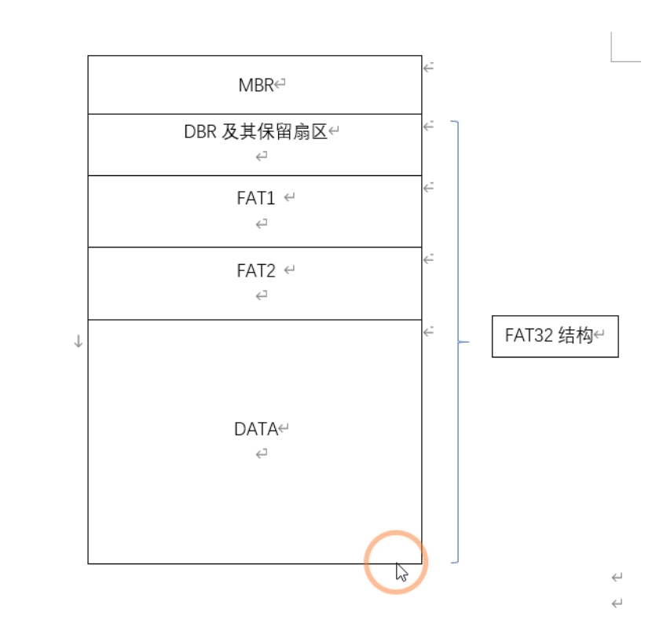

# MBR字节分析
| 字节偏移 | 字段长度 | 字段名和定义 |
| --- | --- | --- |
| 0X01BE | 1字节 | 引导标志：指明该分区是否为活动分区 活动分区：80 |
| 0X01BF | 1字节 | 开始磁头 |
| 0X01C0 | 6位 | 起始扇区 |
| 0X01C1 | 10位 | 起始柱面 |
| 0X01C2 | 1字节 | 分区类型 |
| 0X01C3 | 1字节 | 结束磁头 |
| 0X01C4 | 6位 | 结束扇区 |
| 0X01C5 | 10位 | 结束柱面 |
| 0X01C6 | 4字节 | 分区起始扇区号 |
| 0X01CA | 4字节 | 分区总扇区数 |

# FAT 16 DBR分析
## BPB 参数
| 字段偏移 | 字段长度 | 字段名 |
| --- | --- | --- |
| 0X0B | 2 | 每扇区字节数 |
| 0X0D | 1 | 每簇扇区数 |
| 0X0E | 2 | DBR保留扇区数 |
| 0X10 | 1 | FAT表个数 |
| 0X16 | 2 | 每FAT表包含的扇区数 |
| 0X1C | 4 | 隐藏扇区数 |
| 0X20 | 4 | 扇区总数 |
|  |  |  |

- FAT16 的DBR引导程序占用448字节
# 
# FAT 32 DBR字节分析

## BPB参数
| 字段偏移 | 字段长度 | 字段名 |
| --- | --- | --- |
| 0X0B | 2 | 每扇区字节数 |
| 0X0D | 1 | 每簇扇区数 |
| 0X0E | 2 | DBR保留扇区数 |
| 0X10 | 1 | FAT表个数 |
| 0X1C | 4 |  隐藏扇区数 |
| 0X20 | 4 | 扇区总数 |
| 0X24 | 4 | 每FAT扇区数 |
| 0X2C | 4 | 根目录首簇号 |
| 0X32 | 2 | DBR备份扇区 |
|  |  |  |

- FAT32的DBR引导程序占用420字节。

# NTFS

## DBR分析

### 跳转指令

跳转指令占用2字节，它将程序执行流程跳转到引导程序处。

### OEM代号

OEM代号占8字节，由厂商具体安排。

###  BPB参数

| 字节偏移 | 字段长度 | 字段名                 | 字节偏移 | 字段长度 | 字段名             |
| -------- | -------- | ---------------------- | -------- | -------- | ------------------ |
| 0X0B     | 2        | 每扇区字节数           | 0X24     | 4        | 总为80008000       |
| 0X0D     | 1        | 每簇扇区数             | 0X28     | 8        | 扇区总数           |
| 0X0E     | 2        | 保留扇区数             | 0X30     | 8        | $MFT起始簇号       |
| 0X10     | 3        | 总是0                  | 0X38     | 8        | $MFTMirr起始簇号   |
| 0X13     | 2        | 未使用，为0            | 0X40     | 1        | 文件记录的大小描述 |
| 0X15     | 1        | 介质描述符             | 0X41     | 3        | 未用               |
| 0X16     | 2        | 总是0                  | 0X44     | 1        | 索引缓冲的大小描述 |
| 0X18     | 2        | 每磁道扇区数           | 0X45     | 3        | 未用               |
| 0X1A     | 2        | 磁头数                 | 0X48     | 8        | 卷序列号           |
| 0X1C     | 4        | 隐藏扇区数  (MBR=>DBR) | 0X50     | 4        | 校验和             |
| 0X20     | 4        | 未使用，为0            |          |          |                    |

PS:DBR记录的扇区总数比MBR记录的扇区总数小1
