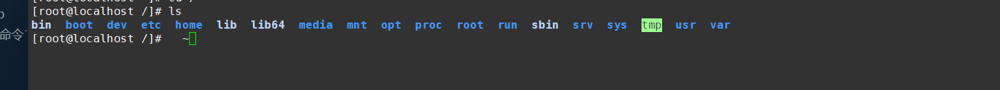

# Linux文件结构

##  1.Linux目录结构

  

* **Linux没有盘符这个概念，只有一个根目录`/`，所有文件都在他下面**



   在 Linux 系统中，有几个目录是比较重要的，平时需要注意不要误删除或者随意更改内部文件。

​        **/etc**： 这个是系统中的配置文件，如果你更改了该目录下的某个文件可能会导致系统不能启动。

​        **/bin, /sbin, /usr/bin, /usr/sbin**: 这是系统预设的执行文件的放置目录，比如 ls 就是在/bin/ls 目录下的。

​        值得提出的是，/bin, /usr/bin 是给系统用户使用的指令（除root外的通用户），而/sbin, /usr/sbin 则是给root使用的指令。

​        **/var**： 这是一个非常重要的目录，系统上跑了很多程序，那么每个程序都会有相应的日志产生，而这些日志就被记录到这个目录        下，具体在/var/log 目录下，另外mail的预设放置也是在这里。

## 2.基本概念

###  用户目录

位于/hoem/user，称之为用户工作目录或者家目录。例如：

```powershell
[root@localhost /]# cd /home
[root@localhost home]# ls
ljj
```


### 登录信息

```
[root@localhost /]#

Linux的bash解析器终端用来显示主机名和当前用户的标识；

# root表示bai当前用户叫root（系统管理员账户）
# localhost表示当前使用的主机名叫localhost（没有设置系bai统名字的时候默认名称是localhost）
# / 表示你当前所处的目录位置 (这里的'/'表示你当前在根目录下)
```


###  相对路径和绝对路径

​        **相对路径**

​                从当前位置开始描述的路径为相对路径，如：

```
[root@localhost /]# cd ../../
[root@localhost /]# ls abc/def
```

​        **绝对路径**

​                从/目录开始描述的路径为绝对路径，如：

```
[root@localhost /]# cd /home/msb123
[root@localhost /]# ls /usr
```

​        **. 和 ..**

​        每个目录下都有**.**和**..**

```
. 表示当前目录

.. 表示上一级目录，即父目录
```

（注意  **根目录下的  .  和  ..  都表示当前目录**）

###    **文件权限**

​        文件权限就是文件的访问控制权限，即哪些用户和组群可以访问文件以及可以执行什么样的操作。

​        Unix/Linux系统是一个典型的多用户系统，不同的用户处于不同的地位，对文件和目录有不同的访问权限。为了保护系统的安全性Unix/Linux系统除了对用户权限作了严格的界定外，还在用户身份认证、访问控制、传输安全、文件读写权限等方面作了周密的控制。

​        在 Unix/Linux中的每一个文件或目录都包含有访问权限，这些访问权限决定了谁能访问和如何访问这些文件和目录。

​    **访问用户**

通过设定权限可以从以下三种访问 方式限制访问权限：

>- 只允许用户自己访问（所有者） 所有者就是创建文件的用户，用户是所有用户所创建文件的所有者，用户可以允许所在的用户组能访问用户的文件。
>- 允许一个预先指定的用户组中的用户访问（用户组） 用户都组合成用户组，例如，某一类或某一项目中的所有用户都能够被系统管理员归为一个用户组，一个用户能够授予所在用户组的其他成员的文件访问权限。
>- 允许系统中的任何用户访问（其他用户） 用户也将自己的文件向系统内的所有用户开放，在这种情况下，系统内的所有用户都能够访问用户的目录或文件。在这种意义上，系统内的其他所有用户就是 other 用户类

​      **访问权限**

​        用户能够控制一个给定的文件或目录的访问程度，一个文件或目录可能有读、写及执行权限：

```
- ​        读权限（r） 对文件而言，具有读取文件内容的权限；对目录来说，具有浏览目录的权限。
- ​        写权限（w） 对文件而言，具有新增、修改文件内容的权限；对目录来说，具有删除、移动目录内文件的权限。
- ​        可执行权限（x） 对文件而言，具有执行文件的权限；对目录来说该用户具有进入目录的权限。
```

​        注意：通常，Unix/Linux系统只允许文件的属主(所有者)或超级用户改变文件的读写权限。

 

 ```
 [root@localhost /]# ls -l
 total 28
 lrwxrwxrwx.   1 root root    7 Nov 30 01:32 bin -> usr/bin
 dr-xr-xr-x.   5 root root 4096 Nov 30 01:38 boot
 drwxr-xr-x.  19 root root 3280 Dec  1 22:13 dev
 drwxr-xr-x. 145 root root 8192 Dec  1 22:06 etc
 drwxr-xr-x.   3 root root   17 Nov 30 01:37 home
 lrwxrwxrwx.   1 root root    7 Nov 30 01:32 lib -> usr/lib
 lrwxrwxrwx.   1 root root    9 Nov 30 01:32 lib64 -> usr/lib64
 drwxr-xr-x.   2 root root    6 Apr 10  2018 media
 drwxr-xr-x.   2 root root    6 Apr 10  2018 mnt
 drwxr-xr-x.   3 root root   16 Nov 30 01:34 opt
 dr-xr-xr-x. 273 root root    0 Dec  1 22:12 proc
 # 首先第一个字母 在Linux中第一个字符代表这个文件是目录、文件或链接文件等等。
 [ d ] 表示目录
 [ l ] 表示为链接文档(link file)
 [ - ] 表示为文件
 [ b ] 表示为装置文件里面的可供储存的接口设备(可随机存取装置)
 [ c ] 表示为装置文件里面的串行端口设备，例如键盘、鼠标(一次性读取装置)
 
 # 其次接下来的字符中，以三个为一组，且均为 [ rwx ] 的三个参数的组合
 [ r ]代表可读(read)
 [ w ]代表可写(write)
 [ x ]代表可执行(execute)
 [ - ]
 
 # 要注意的是，这三个权限的位置不会改变，如果没有权限，就会出现减号[ - ]而已。
 
   此时问题来了那么这三组一样是有什么区分尼？
 # 这里就涉及到刚才所描述的访问用户权限
 # 所有者    所有者表示该文件的所有者
 # 用户组    表示当前用户再同一组
 # 其他用户  允许系统中的任何用户访问，系统内的其他所有用户就是 other 用户类
 
 # 可以将这个权限进行类比，如我的篮球，
 # 所有者表示的是我可以玩 
 # 用户组表示，我可以借给我同班同学玩
 # 其他用户表示，我可以借给其他班的同学玩
 ```

  **文件属主与属组**

​        对于文件来说，它都有一个特定的所有者，也就是对该文件具有所有权的用户。

​        同时，在Linux系统中，用户是按组分类的，一个用户属于一个或多个组。

​        文件所有者以外的用户又可以分为文件所有者的同组用户和其他用户。

​        因此，Linux系统按文件所有者、文件所有者同组用户和其他用户来规定了不同的文件访问权限。


```bash
[root@localhost /]# ls -l
总用量 20
...
dr-xr-xr-x.   5 root root 4096 8月  31 15:58 boot
...

[root@localhost /]# cd /home
[root@localhost home]# ls -l
总用量 0
drwx------. 2 msb123 msb123 83 9月   2 15:54 msb123


# 在以上实例中，msb123 文件是一个目录文件，属主和属组都为 msb123，属主有可读、可写、可执行的权限；与属主同组的用户无权限读写执行；其他用户也无权限读写执行

# 对于 root 用户来说，一般情况下，文件的权限对其不起作用。
```


## 3.基本命令

   ###    1、ls

``` bash
ls 命令
作用：Linux ls命令用于显示指定工作目录下之内容（列出目前工作目录所含之文件及子目录)。

语法： ls   [-alrtAFR](选项)    [name...](参数)

参数：

-a 显示所有文件及目录 (ls内定将文件名或目录名称开头为"."的视为隐藏档，不会列出) 示例如下：
[root@localhost ~]# ls -a
.  ..  anaconda-ks.cfg  .bash_history  .bash_logout  .bash_profile  .bashrc  .cshrc  .tcshrc


-l 除文件名称外，亦将文件型态、权限、拥有者、文件大小等资讯详细列出  示例如下：
[root@localhost ~]# ls -l
总用量 4
-rw-------. 1 root root 1437 8月  31 15:54 anaconda-ks.cfg


-r 将文件以相反次序显示(原定依英文字母次序) 示例如下：
[root@localhost ~]# ls -ra
.tcshrc  .cshrc  .bashrc  .bash_profile  .bash_logout  .bash_history  anaconda-ks.cfg  ..  .


-t 将文件依建立时间之先后次序列出   示例如下：
[root@localhost ~]# ls -lt
总用量 4
-rw-------. 1 root root 1437 8月  31 15:54 anaconda-ks.cfg


-A 同 -a ，但不列出 "." (目前目录) 及 ".." (父目录)   示例如下：
[root@localhost ~]# ls -A
anaconda-ks.cfg  .bash_history  .bash_logout  .bash_profile  .bashrc  .cshrc  .tcshrc

-F 在列出的文件名称后加一符号；例如可执行档则加 "*", 目录则加 "/"   示例如下：
[root@localhost ~]# ls -F /home
msb123/


-R 若目录下有文件，则以下之文件亦皆依序列出  示例如下：
[root@localhost ~]# ls -R /home
/home:
msb123

/home/msb123:
```

```
常用组合
[1]查看文件详情：ls -l 或 ll
[2]增强对文件大小易读性，以人类可读的形式显示文件大小： ls -lh
[3]对文件或者目录进行从大到小的排序： ls -lhs
[4]查看当前目录下的所有文件或者目录，包括隐藏文件： ls -la
[5]只查看当前目录下的目录文件： ls -d .
[6]按照时间顺序查看，从上到倒下时间越来越近： ls -ltr
[7]查看文件在对应的inode信息：ls -li
```

### 2.cd

```bash
  cd 命令


作用：变换当前目录到dir。默认目录为home，可以使用绝对路径、或相对路径。


语法：cd [dir](路径)

# 跳到用户目录下
[root@localhost ~]# cd /home/msb123
[root@localhost msb123]# 
 
 

# 回到home目录
[root@localhost msb123]# cd ~
[root@localhost ~]# 


# 跳到上次所在目录
[root@localhost ~]# cd -
/home/msb123
[root@localhost msb123]#


# 跳到父目录(也可以直接使用 cd ..)
[root@localhost msb123]# cd ./..
[root@localhost home]# 


# 再次跳到上次所在目录
[root@localhost home]# cd -
/home/msb123
[root@localhost msb123]# 


# 跳到当前目录的上两层
[root@localhost msb123]# cd ../..
[root@localhost /]#


# 把上个命令的最后参数作为dir
这里我们先将文件夹cd 到python2.7路径
[root@localhost /]# cd /usr/include/python2.7/
[root@localhost python2.7]#

# 这里使用cd ./..参数作为引子
[root@localhost python2.7]# cd ./..

# 这里我们使用命令，重复最后一个命令参数，直到回到了根目录
[root@localhost include]# cd !$
cd ./..
[root@localhost usr]# cd ./..
[root@localhost /]# 
```

###  3.mkdir

​         **作用：**命令用来创建指定的名称的目录，要求创建目录的用户在当前目录中具有写权限，并且指定的目录名不能是当前目录中已有的目录

​           **语法：**mkdir   [选项]   目录

​           **命令功能：**通过 mkdir 命令可以实现在指定位置创建以 DirName(指定的文件名)命名的文件夹或目录。要创建文件夹或目录的用户必须对所创建的文件夹的父文件夹具有写权限。并且，所创建的文件夹(目录)不能与其父目录(即父文件夹)中的文件名重名，即同一个目录下不能有同名的(区分大小写)

​           **命令参数：**

| 选项参数 | 完整参数                             | 功能描述                                                     |
| -------- | ------------------------------------ | ------------------------------------------------------------ |
| -m       | --mode=模式                          | 设定权限<模式> (类似 chmod)，而不是 rwxrwxrwx 减 umask       |
| -p       | --parents                            | 可以是一个路径名称。<br/>此时若路径中的某些目录尚不存在,加上此选项后,<br/>系统将自动建立好那些尚不存在的目录,即一次可以建立多个目录; |
| -v       | --verbose<br />--help<br />--version | --verbose 每次创建新目录都显示信息<br/>--help显示此帮助信息并退出<br/>--version输出版本信息并退出 |

### 4.touch

**touch**

​           **作用：**用于修改文件或者目录的时间属性，包括存取时间和更改时间。若文件不存在，系统会建立一个新的文件。

​                      ls -l 可以显示档案的时间记录。

​           **语法：**touch \[-acfm] \[-d<日期时间>] \[-r<参考文件或目录>]  \[-t<日期时间>]  \[--help]  \[--version]  \[文件或目录…]

​           **命令参数：**

| 参数        | 参数描述                                                  |
| ----------- | --------------------------------------------------------- |
| -a          | 只更新访问时间，不改变修改时间                            |
| -m          | 改变修改时间记录                                          |
| -c          | 不创建不存在的文件                                        |
| -f          | 不使用，是为了与其他 unix 系统的相容性而保留。            |
| -m          | 只更新修改时间，不改变访问时间                            |
| -r file     | 使用文件file的时间更新文件的时间                          |
| -t          | 将时间修改为参数指定的日期,如：07081556代表7月8号15点56分 |
| --no-create | 不会建立文件                                              |
| --help      | 列出指令格式                                              |
| --version   | 列出版本讯息                                              |

### 5.rm

**rm**

​           **作用：**用于删除一个文件或者目录。

​           **语法：**rm [选项] 文件…

​           **命令参数：**

| 参数 | 参数描述                                                    |
| ---- | ----------------------------------------------------------- |
| -i   | 删除前逐一询问确认                                          |
| -f   | 即使原档案属性设为唯读，亦直接删除，无需逐一确认            |
| -r   | 将目录及以下之档案亦逐一删除  (递归删除) 用这个之前最好 -ir |

### 6.rmdir

rmdir

​           **作用：**用于删除空的目录。从一个目录中删除一个或多个子目录项，删除某目录时也必须具有对其父目录的写权限。

​           **语法：**rmdir [-p] dirName

​           **命令参数：**

| 参数 | 参数描述                                               |
| ---- | ------------------------------------------------------ |
| -p   | 当子目录被删除后使它也成为空目录的话，则顺便一并删除。 |

​           注意（不能删除非空目录）

### 7.mv

mv

​           **作用：**用来为文件或目录改名、或将文件或目录移入其它位置。

​           **语法：**

```
mv [options] source dest
mv [options] source... directory
```

​           **命令参数：**

| 参数 | 参数描述                                        |
| ---- | ----------------------------------------------- |
| -i   | 若指定目录已有同名文件，则先询问是否覆盖旧文件; |
| -f   | 在 mv 操作要覆盖某已有的目标文件时不给任何指示  |

​           mv参数设置与运行结果

| 命令格式         | 运行结果                                                     |
| :--------------- | :----------------------------------------------------------- |
| mv 文件名 文件名 | 将源文件名改为目标文件名                                     |
| mv 文件名 目录名 | 将文件移动到目标目录                                         |
| mv 目录名 目录名 | 目标目录已存在，将源目录移动到目标目录；目标目录不存在则改名 |
| mv 目录名 文件名 | 出错                                                         |

### 8.head

cp

​           **作用：**用于复制文件或目录。

​           **语法：**

```bash
cp [options] source dest

cp [options] source... directory
```

​           **命令参数：**

| 参数 | 参数功能描述                                                 |
| ---- | ------------------------------------------------------------ |
| -a   | 此选项通常在复制目录时使用，它保留链接、文件属性，并复制目录下的所有内容。其作用等于dpR参数组合 |
| -d   | 复制时保留链接。这里所说的链接相当于Windows系统中的快捷方式。 |
| -f   | 覆盖已经存在的目标文件而不给出提示。                         |
| -i   | 与-f选项相反，在覆盖目标文件之前给出提示，要求用户确认是否覆盖，回答"y"时目标文件将被覆盖。 |
| -p   | 除复制文件的内容外，还把修改时间和访问权限也复制到新文件中。 |
| -r   | 若给出的源文件是一个目录文件，此时将复制该目录下所有的子目录和文件。 |
| -l   | 不复制文件，只是生成链接文件。                               |

### 9.cat

cat

​           **作用：**用于连接文件并打印到标准输出设备上

​           **语法：**cat [-AbeEnstTuv] [--help] [--version] fileName

​           **命令参数：**

|        |                        |                                                    |
| ------ | ---------------------- | -------------------------------------------------- |
| **-n** | **--number**           | 由 1 开始对所有输出的行数编号                      |
| **-b** | **--number-nonblank**  | 和 -n 相似，只不过对于空白行不编号                 |
| **-s** | **--squeeze-blank**    | 当遇到有连续两行以上的空白行，就代换为一行的空白行 |
| **-v** | **--show-nonprinting** | 使用 ^ 和 M- 符号，除了 LFD 和 TAB 之外            |
| **-E** | **--show-ends**        | 在每行结束处显示 $                                 |
| **-T** | **--show-tabs**        | 将 TAB 字符显示为 ^I                               |
| **-A** | **--show-all**         | 等价于 -vET                                        |
| **-e** |                        | 等价于"-vE"选项                                    |
| **-t** |                        | 等价于"-vT"选项                                    |

### more

more

​           **作用：**类似 cat ，不过会以一页一页的形式显示，更方便使用者逐页阅读，而最基本的指令就是按空白键（space）就往下一页显示，按 b 键就会往回（back）一页显示，而且还有搜寻字串的功能（与 vi 相似），使用中的说明文件，请按 h 

​           **语法：**more [-dlfpcsu] [-num] [+/pattern] [+linenum] [fileNames..]

​           **命令参数：**

| 参数      | 参数功能描述                                                 |
| --------- | ------------------------------------------------------------ |
| -num      | 一次显示的行数                                               |
| -d        | 提示使用者，在画面下方显示 [Press space to continue, 'q' to quit.] ，<br />如果使用者按错键，则会显示 [Press 'h' for instructions.] 而不是 '哔' 声 |
| -l        | 取消遇见特殊字元 ^L（送纸字元）时会暂停的功能                |
| -f        | 计算行数时，以实际上的行数，而非自动换行过后的行数（有些单行字数太长的会被扩展为两行或两行以上） |
| -p        | 不以卷动的方式显示每一页，而是先清除萤幕后再显示内容         |
| -c        | 跟 -p 相似，不同的是先显示内容再清除其他旧资料               |
| -s        | 当遇到有连续两行以上的空白行，就代换为一行的空白行           |
| -u        | 不显示下引号 （根据环境变数 TERM 指定的 terminal 而有所不同） |
| +/pattern | 在每个文档显示前搜寻该字串（pattern），然后从该字串之后开始显示 |
| +num      | 从第 num 行开始显示                                          |
| fileNames | 需要显示内容的文档，可为复数个数                             |

​           常用的操作命令

| 按键   | 按键功能描述                     |
| ------ | -------------------------------- |
| Enter  | 向下 n 行，需要定义。默认为 1 行 |
| Ctrl+F | 向下滚动一屏                     |
| 空格键 | 向下滚动一屏                     |
| Ctrl+B | 返回上一屏                       |
| =      | 输出当前行的行号                 |
| :f     | 输出文件名和当前行的行号         |
| V      | 调用vi编辑器                     |
| !命令  | 调用Shell，并执行命令            |
| q      | 退出more                         |