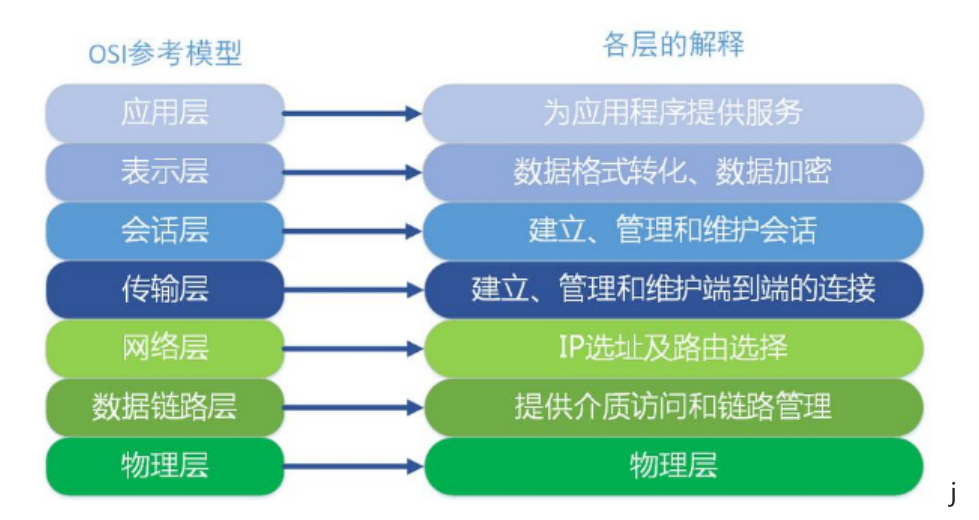
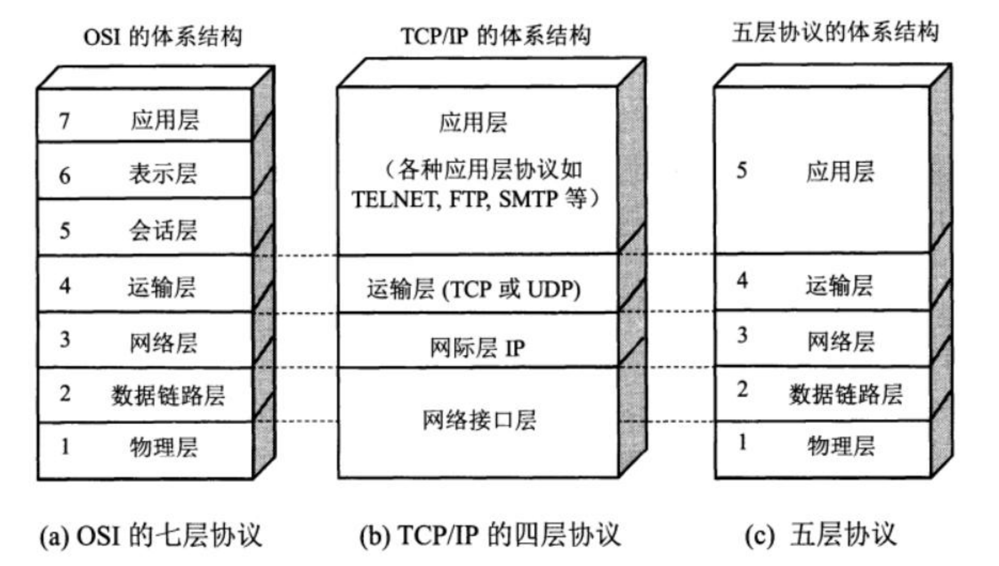

# 常用的计算机体系结构

## OSI体系结构

1.OSI是一个七层协议的体系结构：从下往上依次是：

## TCP/IP体系结构

1. TCP/IP体系结构是一种四层体系结构，它包含**应用层，运输层，网际层和网络接口层**，（用网际层这个名字是强调这一层是为了解决不同网络的互联问题）。

2. OSI七层协议体系结构概念清楚，理论也比较完整，但是过于复杂不实用。

3. 在学习计算机网络原理的时候采用折中的方法，即综合OSI和TCP/IP的优点，采用一种只有五层协议的体系结构，这样即简洁又能将概念阐述清楚，有时为了方便，也可把最底下的两层称为网络接口层。

    

下面可以非常简要的介绍一下各层的功能。

* 应用层 (application player)
  * 应用层是体系结构中的最高层。应用层的任务是通过应用进程间的交互来完成特定网络应用。应用层协议定义的是应用进程间通信和交互规则。这里的进程就是指主机中正在运行的程序。对于不同的网络需要有不同的应用层协议。在互联网中的应用层协议很多，如域名系统DNS，支持万维网的应用的HTTP协议，支持电子邮件的SMTP协议等等，我们吧应用层交互的数据单元叫做报文(message).
* 